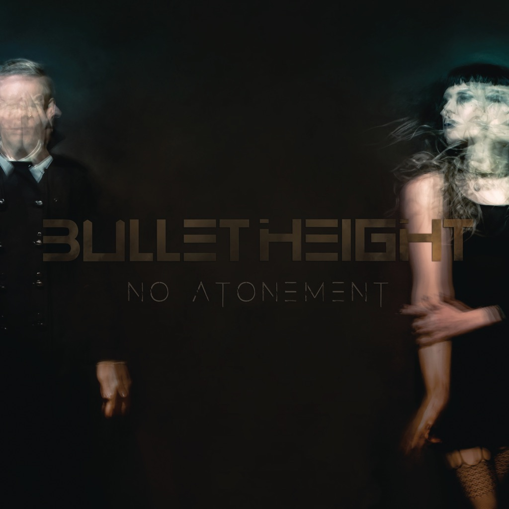

<!-- section break -->

1. Fight Song
2. Bastion
3. Hold Together
4. Wild Words
5. Intravenous
6. Cadence
7. No Atonement
8. Break Our Hearts Down
9. Fever
10. Up To The Neck
11. Fight Song (3:31)
12. Bastion (4:08)
13. Hold Together (4:08)
14. Wild Words (3:52)
15. Intravenous (4:42)
16. Cadence (4:23)
17. No Atonement (3:38)
18. Break Our Hearts Down (4:47)
19. Fever (3:44)
20. Up To The Neck (6:02)

<!-- section break -->

## Spotify


## Videos
### BULLET HEIGHT - Break Our Hearts Down (Album Track)
 

### More Videos

- [Fight Song](https://www.youtube.com/watch?v=0lyWF-I7pZA)
- [BULLET HEIGHT - Bastion (Official Track)](https://www.youtube.com/watch?v=kmlmn3YHpNs)
- [BULLET HEIGHT - Hold Together (OFFICIAL VIDEO)](https://www.youtube.com/watch?v=Qfie7ok8-XI)
- [Wild Words](https://www.youtube.com/watch?v=EcshkqnUp9o)
- [Intravenous](https://www.youtube.com/watch?v=TFVsojTL7rc)
- [Cadence](https://www.youtube.com/watch?v=oLChpiZ2WQk)
- [No Atonement](https://www.youtube.com/watch?v=PxE2Bmf3VpY)
- [Fever](https://www.youtube.com/watch?v=Z6hnJrBKOKw)
- [Break Our Hearts Down](https://www.youtube.com/watch?v=xHItLkOiP3g)

## Release Information
|  Key           | Value                                                |
| ---------------| ---------------------------------------------------- |
| Release Year   | 2017                                   |
| Discogs Link   | [Bullet Height - No Atonement](https://www.discogs.com/release/10376234-Bullet-Height-No-Atonement) |
| Label          | Superball Music |
| Format         | Vinyl LP Album (Green Petrol Transparent), CD Album, All Media Limited Edition |
| Catalog Number | SBMLP 044 |
| Notes | Limited to 1000 copies. |