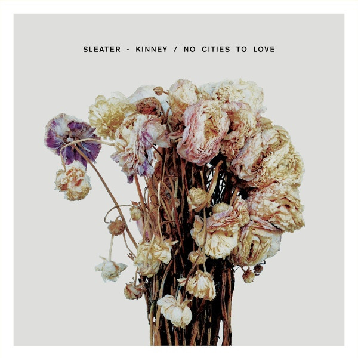

<!-- section break -->

1. Price Tag
2. Fangless
3. Surface Envy
4. No Cities To Love
5. A New Wave
6. No Anthems
7. Gimme Love
8. Bury Our Friends
9. Hey Darling
10. Fade

<!-- section break -->

## Spotify


## Videos
### Sleater-Kinney - Fangless
 

### More Videos

- [Sleater-Kinney - No Cities To Love](https://www.youtube.com/watch?v=Cj2k3QsHmyM)
- [Sleater-Kinney - A New Wave [OFFICIAL VIDEO]](https://www.youtube.com/watch?v=Kc1htX3q-F0)
- [Sleater-Kinney - Price Tag](https://www.youtube.com/watch?v=TWc6knXULsw)
- [Sleater-Kinney - No Cities to Love](https://www.youtube.com/watch?v=_jiX-Svw7KQ)

## Release Information
|  Key           | Value                                                |
| ---------------| ---------------------------------------------------- |
| Release Year   | 2015                                   |
| Discogs Link   | [Sleater-Kinney - No Cities To Love](https://www.discogs.com/release/7761945-Sleater-Kinney-No-Cities-To-Love) |
| Label          | Sub Pop |
| Format         | Vinyl LP Album (Gatefold) |
| Catalog Number | SP1100 |
| Notes | Black vinyl edition, comes in a triple gatefold cover.    Includes a four page sheet with lyrics and credits and a coupon with free download code.   Exclusive Barnes & Noble edition with art print signed by the band.     All songs written by Sleater Kinney.  Code Word Nemesis (ASCAP)    ©℗ 2015 Sub Pop Records.    Back Cover Photograph: Eso, "Colour-Composite of the Sky Field with Several High-Redshift Galaxies"   |