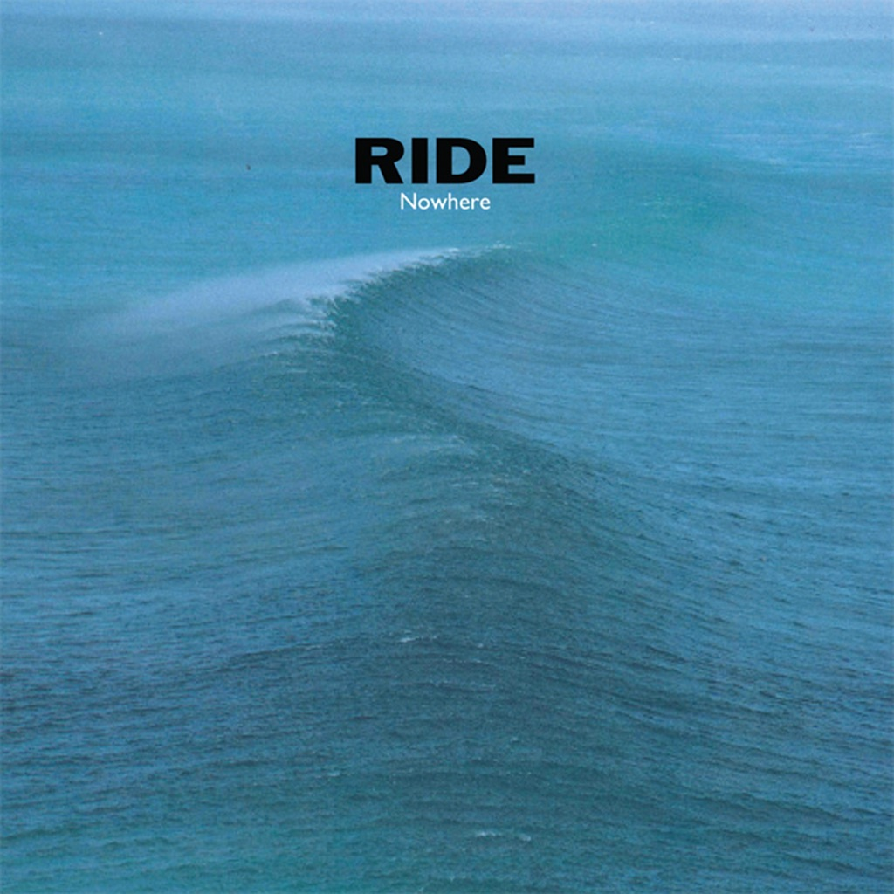

<!-- section break -->

1. Seagull
2. Kaleidoscope
3. In A Different Place
4. Polar Bear
5. Dreams Burn Down
6. Decay
7. Paralysed
8. Vapour Trail

<!-- section break -->

## Spotify


## Videos
### Ride - Here And Now
 

### More Videos

- [Ride - Taste (Video)](https://www.youtube.com/watch?v=APqGzOD0fUk)
- [Ride-Seagull](https://www.youtube.com/watch?v=wF0FO5riglY)
- [Ride - Vapour Trail (Video)](https://www.youtube.com/watch?v=pVhNi5cU8mo)
- [Ride- Kaleidoscope](https://www.youtube.com/watch?v=JucqVvhitWE)
- [Ride- In a different place](https://www.youtube.com/watch?v=ADvP07t1mHo)
- [Ride-Polar Bear](https://www.youtube.com/watch?v=XxCO2agDG_U)
- [Ride- Dreams burn down](https://www.youtube.com/watch?v=E5zTuVhNs5c)
- [Ride- Decay](https://www.youtube.com/watch?v=J9W205fw0G8)
- [Ride - Paralysed](https://www.youtube.com/watch?v=721yIvBq7DI)
- [Ride- Vapour Trail](https://www.youtube.com/watch?v=ygGw_zo_W8A)
- [Ride - Taste](https://www.youtube.com/watch?v=BZ8_c-aFOVg)
- [Ride - Nowhere](https://www.youtube.com/watch?v=NxGAC5inulE)

## Release Information
|  Key           | Value                                                |
| ---------------| ---------------------------------------------------- |
| Release Year   | 2022                                   |
| Discogs Link   | [Ride - Nowhere](https://www.discogs.com/release/25002331-Ride-Nowhere) |
| Label          | Wichita |
| Format         | Vinyl LP Album Limited Edition Reissue (Blue (Curacao) ) |
| Catalog Number | webb572lp |
| Notes | 'Original audio reworked and refined' Transparent Curacao blue coloured standard weight vinyl LP.  Gatefold sleeve, reverse board with embossed artwork. Download included.  Includes a double sided 12" x 12" artwork & photos insert.  webb573lp on sleeve WEBB573LP on hype sticker |