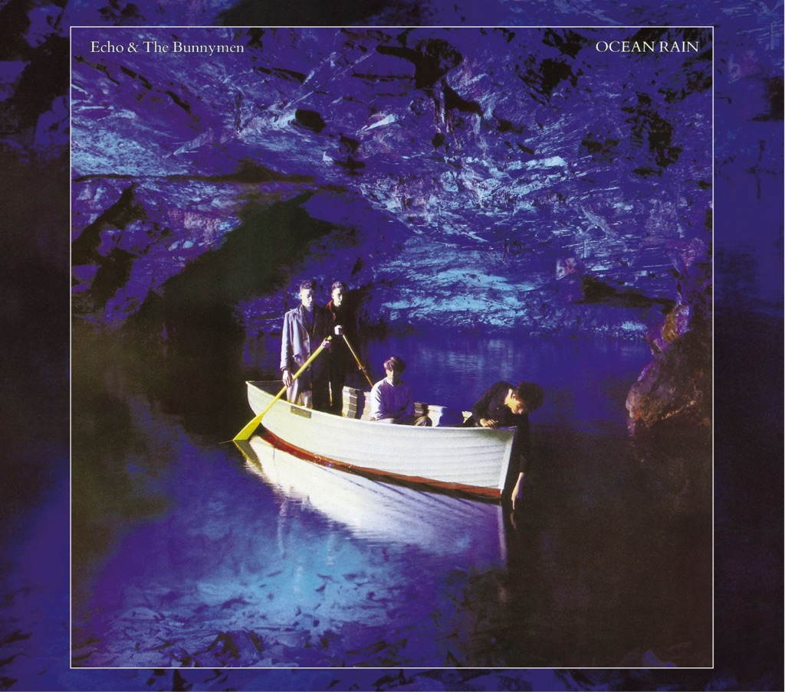

<!-- section break -->

1. Silver (3:19)
2. Nocturnal Me (4:54)
3. Crystal Days (2:24)
4. The Yo Yo Man (3:11)
5. Thorn Of Crowns (4:50)
6. The Killing Moon (5:46)
7. Seven Seas (3:19)
8. My Kingdom (4:06)
9. Ocean Rain (5:10)

<!-- section break -->

## Spotify


## Videos
### Ocean Rain
 

### More Videos

- [Silver](https://www.youtube.com/watch?v=sQ_QRK_iWrk)
- [Nocturnal Me](https://www.youtube.com/watch?v=Pu5PWfFmI4I)
- [Crystal Days](https://www.youtube.com/watch?v=2_uSLF8of-w)
- [The Yo Yo Man](https://www.youtube.com/watch?v=T1gxp2xTeag)
- [Thorn of Crowns](https://www.youtube.com/watch?v=jbMIe_wU1jQ)
- [Echo & The Bunnymen - The Killing Moon (Official Music Video)](https://www.youtube.com/watch?v=LWz0JC7afNQ)
- [Echo & The Bunnymen - Seven Seas (Official Music Video)](https://www.youtube.com/watch?v=LbYxP11rbSM)
- [My Kingdom](https://www.youtube.com/watch?v=2q1RWbAqYtU)
- [ECHO & THE BUNNYMEN - Killing Moon - Lyrics for Fun Scenes and Full Moon](https://www.youtube.com/watch?v=prd9RX-fW2g)

## Release Information
|  Key           | Value                                                |
| ---------------| ---------------------------------------------------- |
| Release Year   | 2014                                   |
| Discogs Link   | [Echo & The Bunnymen - Ocean Rain](https://www.discogs.com/release/5803593-Echo-The-Bunnymen-Ocean-Rain) |
| Label          | Korova |
| Format         | Vinyl LP Album Reissue |
| Catalog Number | VIN180LP075 |
| Notes | 2014 Repressing in Black Vinyl |