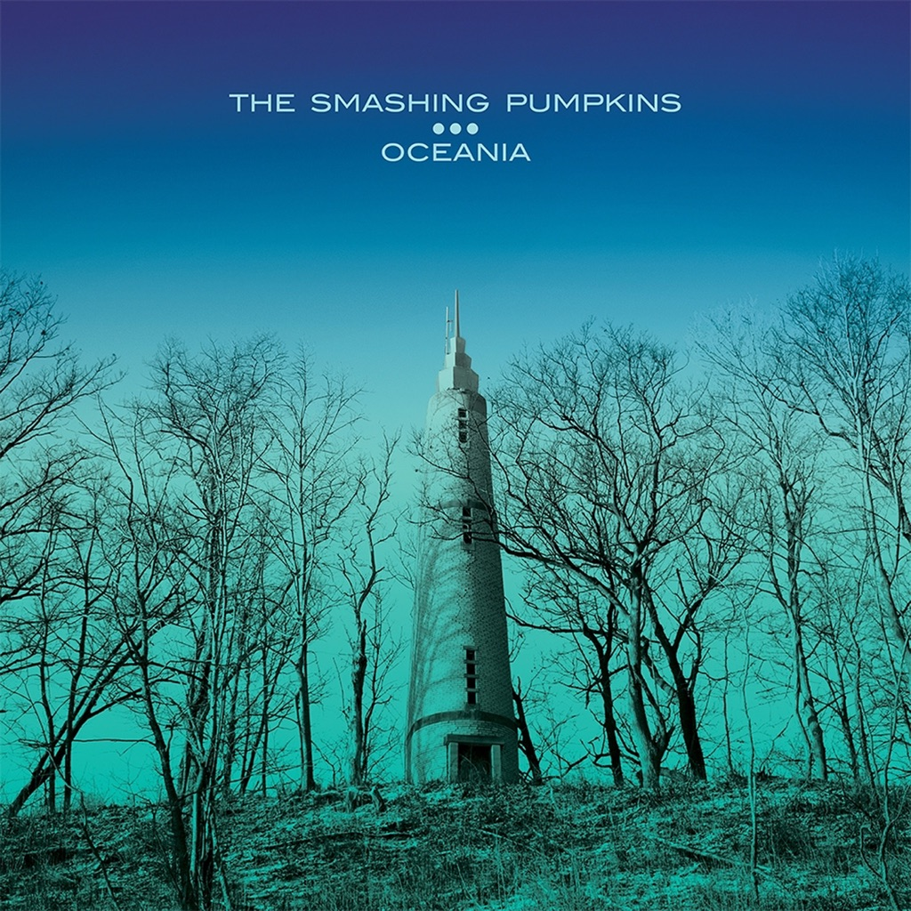

<!-- section break -->

1. Quasar (4:55)
2. Panopticon (3:52)
3. The Celestials (3:57)
4. Violet Rays (4:19)
5. My Love Is Winter (3:32)
6. One Diamond, One Heart (3:50)
7. Pinwheels (5:43)
8. Oceania (9:05)
9. Pale Horse (4:37)
10. The Chimera (4:16)
11. Glissandra (4:06)
12. Inkless (3:08)
13. Wildflower (4:42)

<!-- section break -->

## Spotify


## Release Information
|  Key           | Value                                                |
| ---------------| ---------------------------------------------------- |
| Release Year   | 2012                                   |
| Discogs Link   | [The Smashing Pumpkins - Oceania](https://www.discogs.com/release/3702725-The-Smashing-Pumpkins-Oceania) |
| Label          | Martha's Music |
| Format         | Vinyl 2× LP Album |
| Catalog Number | MM 002 |
| Notes | Gatefold packaging, with lyrics printed inside the sleeve. 180 grams pressing.    Nicole Fiorentino's name is misspelled "Florentino" in the credits.    Sticker:  "Oceania   First studio album from The Smashing Pumpkins in 5 years  On Tour Fall 2012"   |