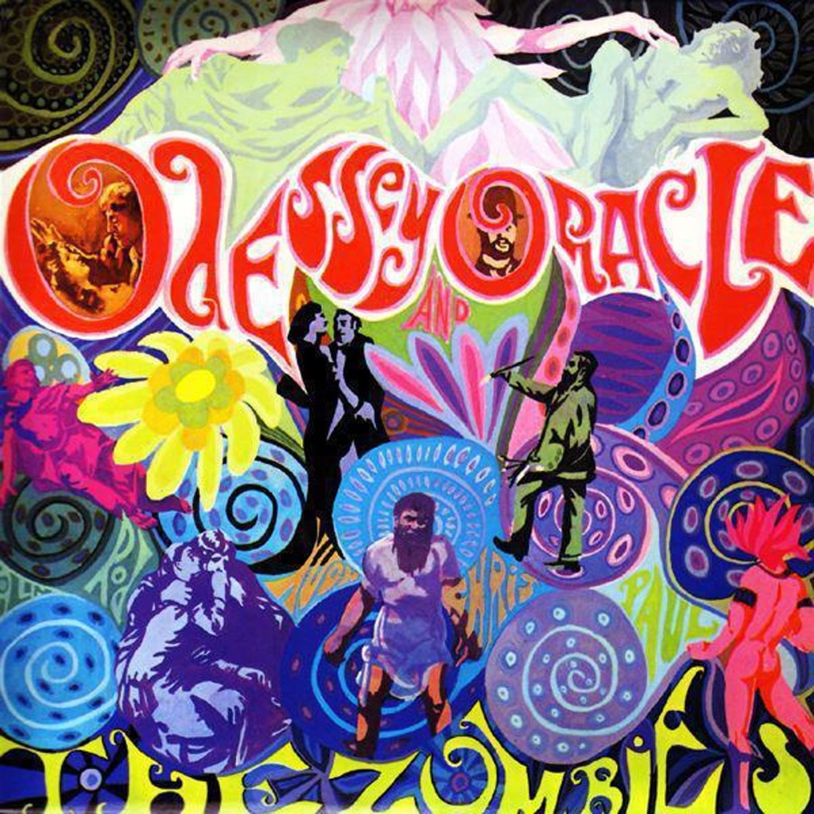

<!-- section break -->

1. Care Of Cell 44
2. A Rose For Emily
3. Maybe After He's Gone
4. Beechwood Park
5. Brief Candles
6. Hung Up On A Dream
7. Changes
8. I Want Her She Wants Me
9. This Will Be Our Year
10. Butcher's Tale (Western Front 1914)
11. Friends Of Mine
12. Time Of The Season

<!-- section break -->

## Spotify


## Videos
### The Zombies - Maybe After He's Gone
 

### More Videos

- [Care Of Cell 44 - The Zombies](https://www.youtube.com/watch?v=afrdo2qneoI)
- [Hung Up On A Dream - The Zombies](https://www.youtube.com/watch?v=8XOd6Uajh-4)
- [The Zombies - This Will Be Our Year](https://www.youtube.com/watch?v=kI2lTwY0Jx8)
- [Beechwood Park - The Zombies](https://www.youtube.com/watch?v=ia2-Bu-2LMA)
- [the zombies a butcher's tale](https://www.youtube.com/watch?v=zMhemzN7sTc)
- [The Zombies - A Rose for Emily](https://www.youtube.com/watch?v=wt2vQkUmpzg)
- [The Zombies - Brief Candles](https://www.youtube.com/watch?v=vnu8H0x4l60)
- [The Zombies - Changes](https://www.youtube.com/watch?v=LHYgpenY0D8)
- [The Zombies   I Want Her She Wants Me](https://www.youtube.com/watch?v=nnTVhidB4z8)
- [The Zombies - 11 - Friends Of Mine (by EarpJohn)](https://www.youtube.com/watch?v=vIJteHQPGr4)
- [THE ZOMBIES - TIME OF THE SEASON - Odessey and Oracle (1968) HiDef :: SOTW #55](https://www.youtube.com/watch?v=-Gf7ettG5Y8)

## Release Information
|  Key           | Value                                                |
| ---------------| ---------------------------------------------------- |
| Release Year   | 0                                   |
| Discogs Link   | [The Zombies - Odessey And Oracle](https://www.discogs.com/release/1317966-The-Zombies-Odessey-And-Oracle) |
| Label          | Big Beat Records |
| Format         | Vinyl LP Album Reissue Stereo |
| Catalog Number | WIKD 181 |
| Notes | 30th Anniversary Edition  "Be not afraid; The isle is full of noises Sound, and sweet airs that give delight and hurt not. Sometimes a thousand twanging instruments Will hum about mine ears; and sometimes voices" (Shakespeare)  Lacquers cut directly from original analogue tapes at Whitfield Street.  "We have used the mono version of 'This Will Be Our Year' for this anniversary edition, rather than using the fake stereo that was used on the original Stereo LP CBS LP S63280. All the other recordings were made in stereo."  ℗ 1968 except [B3] ℗ 1997 Marquis Enterprises (on sleeve) ℗ 1968 Marquis Music Enterprises (on A-side label) ℗ 1968 except [B3] ℗ 1997 Marquis Music Enterprises (on B-side label) |