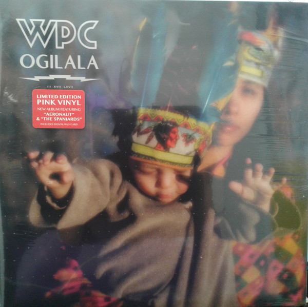

<!-- section break -->

1. Zowie
2. Processional
3. The Spaniards
4. Aeronaut
5. The Long Goodbye
6. Half-Life Of An Autodidact
7. Amarinthe
8. Antietam
9. Mandarynne
10. Shiloh
11. Archer

<!-- section break -->

## Videos
### William Patrick Corgan - Aeronaut
 

### More Videos

- [William Patrick Corgan - The Spaniards](https://www.youtube.com/watch?v=e1ZnYLBKs-o)
- [PILLBOX - Official Trailer (2017)](https://www.youtube.com/watch?v=ULv4EwpJlb8)

## Release Information
|  Key           | Value                                                |
| ---------------| ---------------------------------------------------- |
| Release Year   | 2017                                   |
| Discogs Link   | [WPC - Ogilala](https://www.discogs.com/release/10993416-WPC-Ogilala) |
| Label          | BMG |
| Format         | Vinyl LP Album Limited Edition (Pink) |
| Catalog Number | 538321031 |
| Notes | Issued in gatefold sleeve.  Indie exclusive, limited to 1,000 copies worldwide.  Mixed at Rainbow Studio, Oslo, Norway except B5 mixed at Shangri La Studios, Malibu, CA  Includes download card.  On back cover : Made in USA. |