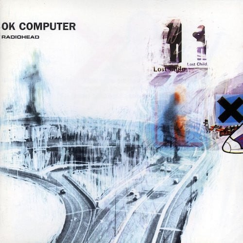

<!-- section break -->

1. eeny
2. Airbag (4:44)
3. Paranoid Android (6:23)
4. Subterranean Homesick Alien (4:27)
5. meeny
6. Exit Music (For A Film) (4:24)
7. Let Down (4:59)
8. Karma Police (4:21)
9. miney
10. Fitter Happier (1:57)
11. Electioneering (3:50)
12. Climbing Up The Walls (4:45)
13. No Surprises (3:48)
14. mo
15. Lucky (4:19)
16. The Tourist (5:24)

<!-- section break -->

## Spotify


## Videos
### Radiohead - Karma Police
 

### More Videos

- [Radiohead - No Surprises](https://www.youtube.com/watch?v=u5CVsCnxyXg)
- [Radiohead - Lift](https://www.youtube.com/watch?v=QBGaO89cBMI)

## Release Information
|  Key           | Value                                                |
| ---------------| ---------------------------------------------------- |
| Release Year   | 2013                                   |
| Discogs Link   | [Radiohead - OK Computer](https://www.discogs.com/release/3339642-Radiohead-OK-Computer) |
| Label          | Parlophone |
| Format         | Vinyl 2× LP Album Reissue Repress (180 Gram, Gatefold) |
| Catalog Number | 7243 8 55229 1 8 |
| Notes | Audio fixing and dubbing done at Mayfair, Abbey Road, Air Lyndhurst, Courtyard and The Curch. Mastered at Abbey Road.  Matrix# on labels "7243 8 55229 1 8" Manufactured and distributed by EMI  Disc I : (eeny/meeny) - 7243 8 55229 1 8                                    (7243 8 57331 1 6)  Disc II : (miney/moo) - 7243 8 55229 1 8                                    (7243 8 57331 1 5)  Manufactured and distributed by EMI Made and Printed in the U.K. lc 0299 NODATA 02  Comes in a gatefold sleeve with printed inner sleeves.  The labels of this release differ from the original release ([r=4950798] & [r=216593]). Specifically, this release features: "A Warner Music Group Company", whereas the others have "EMI Records Ltd.". Please see the provided image.  Pressed by Record Industry using original DMM parts by EMI Records. |