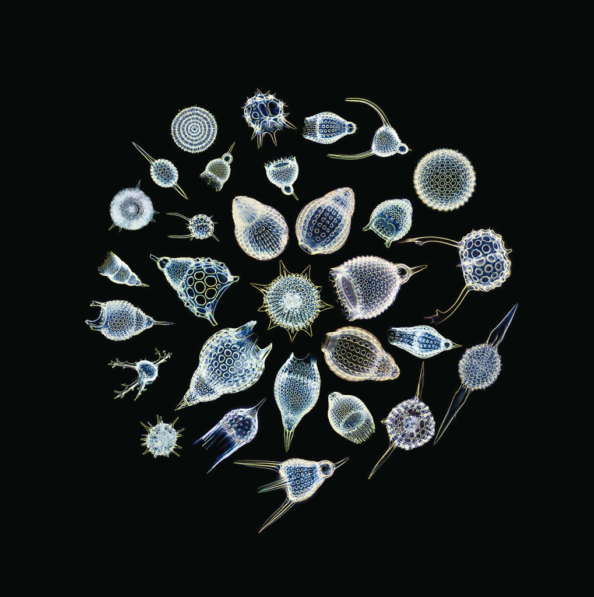

<!-- section break -->

1. After (2:14)
2. Eating A Heart Out (2:50)
3. Big River (2:00)
4. Sea Snake Beware (2:54)
5. Mirmaid's Purse (2:06)
6. Cut Yourself Kidding (3:07)
7. Bye Bye Spirit (4:31)
8. Heaven Haven (1:39)
9. Anchors Away (0:23)
10. On The Dry Land (1:46)
11. The Black Blooded Clam (2:46)
12. The Sea Ritual (2:22)
13. Liberated And Handsome (1:36)
14. A Kind Of Keeper (1:24)
15. Wanky (2:25)

<!-- section break -->

## Videos
### The Sea Nymphs - The Black Blooded Clam
 

## Release Information
|  Key           | Value                                                |
| ---------------| ---------------------------------------------------- |
| Release Year   | 2016                                   |
| Discogs Link   | [The Sea Nymphs - On The Dry Land](https://www.discogs.com/release/9329840-The-Sea-Nymphs-On-The-Dry-Land) |
| Label          | The Alphabet Business Concern |
| Format         | Vinyl LP Album Limited Edition Numbered Reissue |
| Catalog Number | ALPH LP 032 |
| Notes | Limited to 200 numbered, stickered copies.  Includes download card. |