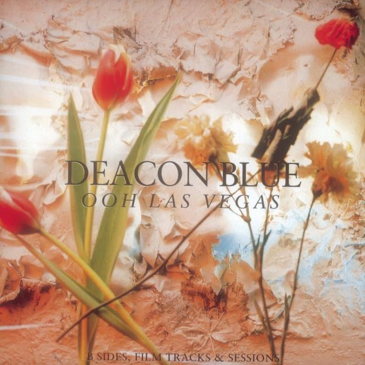

<!-- section break -->

1. Disneyworld (2:49)
2. Ronnie Spector (3:29)
3. My America (3:10)
4. Sharon (4:13)
5. Undeveloped Heart (3:37)
6. Souvenirs (2:41)
7. Born Again (3:23)
8. Down In The Flood (4:37)
9. Back Here In Beanoland (3:01)
10. Love You Say (5:34)
11. Let Your Hearts Be Troubled (6:31)
12. Gentle Teardrops (3:13)
13. Little Lincoln (3:06)
14. That Country (Beneath Your Skin) (3:50)
15. Is It Cold Beneath The Hill? (3:57)
16. Circus Lights (2:56)
17. Trampolene (3:36)
18. Las Vegas (3:55)
19. Killing The Blues (3:49)
20. Long Window To Love (3:12)
21. Christine (2:26)
22. Take Me To This Place (2:26)
23. Don't Let The Teardrops Start (3:01)

<!-- section break -->

## Spotify


## Videos
### Las Vegas
 

### More Videos

- [Deacon Blue - Disneyworld](https://www.youtube.com/watch?v=YuMRvCvBJm0)
- [DEACON BLUE - LET YOUR HEARTS BE TROUBLED](https://www.youtube.com/watch?v=rOMEr-a_nl8)
- [Back Here In Beanoland](https://www.youtube.com/watch?v=nWn6ipzktis)
- [Deacon Blue - Las Vegas](https://www.youtube.com/watch?v=crf3fsAi_WU)
- [My America](https://www.youtube.com/watch?v=2Kkb9iOh5OY)
- [Deacon Blue - S.H.A.R.O.N.](https://www.youtube.com/watch?v=BspKQrrj8GQ)
- [Disneyworld](https://www.youtube.com/watch?v=hXIRGY5OP3I)
- [Deacon Blue - Is It Cold Beneath the Hill [?]](https://www.youtube.com/watch?v=I2G3dosGk4I)

## Release Information
|  Key           | Value                                                |
| ---------------| ---------------------------------------------------- |
| Release Year   | 1990                                   |
| Discogs Link   | [Deacon Blue - Ooh Las Vegas](https://www.discogs.com/release/1395542-Deacon-Blue-Ooh-Las-Vegas) |
| Label          | CBS |
| Format         | Vinyl 2× LP Compilation |
| Catalog Number | 467242 1 |
| Notes | Very similar to [r=1867062] but with a different set of codes and layout in the upper right back cover - above and below the barcode. [r=1867062] also has BIEM/STEMRA and "Made in Holland" on the B & D labels and is a [l371454] pressing |