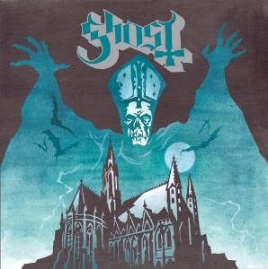

<!-- section break -->

1. Deus Culpa (1:34)
2. Con Clavi Con Dio (3:34)
3. Ritual (4:29)
4. Elizabeth (4:01)
5. Stand By Him (3:56)
6. Satan Prayer (4:38)
7. Death Knell (4:37)
8. Prime Mover (3:53)
9. Genesis (4:03)

<!-- section break -->

## Videos
### Ghost Death Knell (OFFICIAL)
 

## Release Information
|  Key           | Value                                                |
| ---------------| ---------------------------------------------------- |
| Release Year   | 2010                                   |
| Discogs Link   | [Ghost - Opvs Eponymovs](https://www.discogs.com/release/2649116-Ghost-Opvs-Eponymovs) |
| Label          | Rise Above Records |
| Format         | Vinyl LP Album Limited Edition (Green Splatter) |
| Catalog Number | RISELP124 |
| Notes | Album is also known as "Opus Eponymous".     Recorded at Manfire Recordings.  Additional recordings done at White Light Studio.  Mixed and mastered at Orgone Mastering.    ℗ 2010 Rise Above.  © 2010 Rise Above.    Limited to 300 on green with black splatter .   |