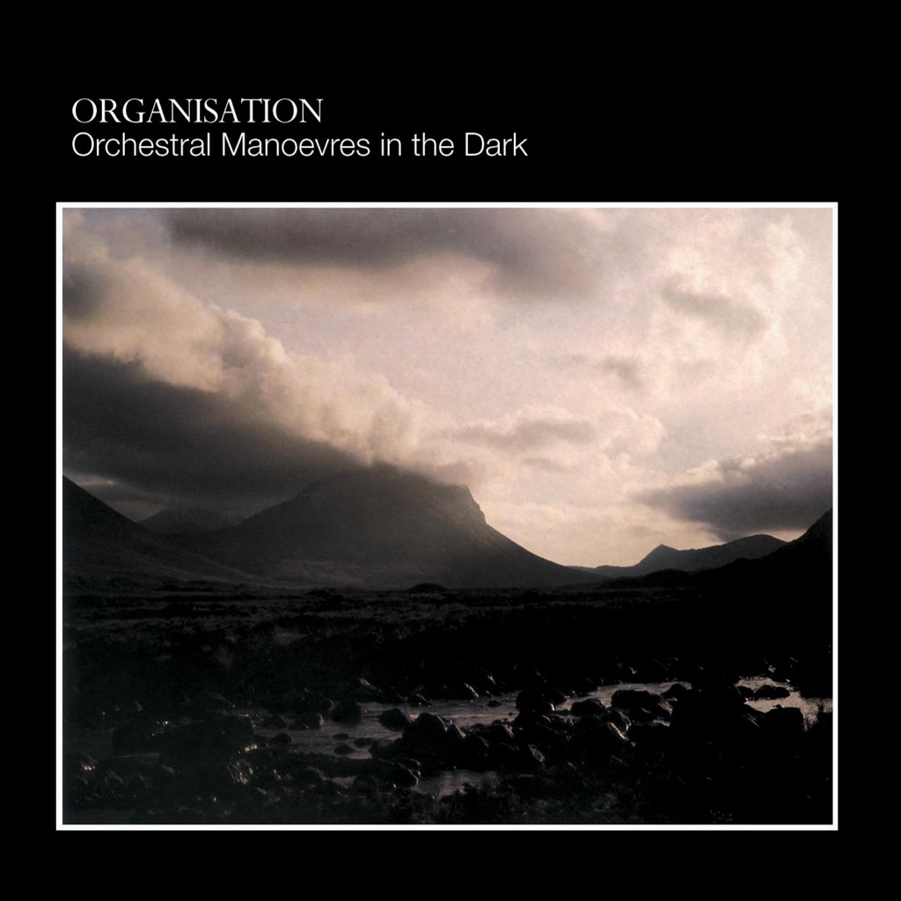

<!-- section break -->

1. Enola Gay (3:25)
2. 2nd Thought (4:03)
3. VCL XI (3:45)
4. Motion And Heart (3:08)
5. Statues (4:05)
6. The Misunderstanding (4:40)
7. The More I See You (4:00)
8. Promise (4:38)
9. Stanlow (6:16)

<!-- section break -->

## Spotify


## Videos
### The Misunderstanding (2003 Digital Remaster)
 

### More Videos

- [Enola Gay (Remastered)](https://www.youtube.com/watch?v=n4mqwJ569_M)
- [2nd Thought (2003 Digital Remaster)](https://www.youtube.com/watch?v=cwkpoF9uvsY)
- [VCL XI (2003 Digital Remaster)](https://www.youtube.com/watch?v=FuOBBAyDWHQ)
- [Motion And Heart (2003 Digital Remaster)](https://www.youtube.com/watch?v=IEqYDv8lMHM)
- [Statues (2003 Digital Remaster)](https://www.youtube.com/watch?v=tpcSuLNuWp4)
- [Annex (2003 Digital Remaster)](https://www.youtube.com/watch?v=djQVPn1Aj2k)
- [The More I See You (2003 Digital Remaster)](https://www.youtube.com/watch?v=07Mt2v1qjsI)
- [Promise (Remastered)](https://www.youtube.com/watch?v=iMAEs9x8KKQ)
- [Stanlow (2003 Digital Remaster)](https://www.youtube.com/watch?v=WuxiaK5MqYg)
- [Introducing Radios (Live From The Factory, UK / 1978 / 2003 Digital Remaster)](https://www.youtube.com/watch?v=PoSXbFAhW-Q)
- [Distance Fades Between Us (Live From The Factory, UK / 1978 / 2003 Digital Remaster)](https://www.youtube.com/watch?v=xGTXscdWzHE)
- [Progress (Live From The Factory, UK / 1978 / 2003 Digital Remaster)](https://www.youtube.com/watch?v=c69Q9MayIkI)
- [Once When I Was Six (Live From The Factory, UK / 1978 / 2003 Digital Remaster)](https://www.youtube.com/watch?v=I-1FY6lff64)
- [Electricity (DinDisc 1980 Version / 2003 Digital Remaster)](https://www.youtube.com/watch?v=toRBdwhlMTY)

## Release Information
|  Key           | Value                                                |
| ---------------| ---------------------------------------------------- |
| Release Year   | 2018                                   |
| Discogs Link   | [Orchestral Manoeuvres In The Dark - Organisation](https://www.discogs.com/release/12748202-Orchestral-Manoeuvres-In-The-Dark-Organisation) |
| Label          | Virgin |
| Format         | Vinyl LP Album Reissue Remastered |
| Catalog Number | 0602557050837 |
| Notes | Issued in right-opening cardboard sleeve with spine including digital download card (WAV files). May have sticker on shrink-wrap. Half speed mastered at Abbey Road Studios.  All tracks recorded and mixed at Ridge Farm and Advision except track A2 recorded at The Gramophone Suite.  All tracks published by BMG VM Music Ltd. except track B2 published by Warner Chappell Music International Ltd.  A Virgin EMI Records Release ℗ 1980 Virgin Records Ltd. © 2018 Virgin Records Ltd. Made in the EU. |