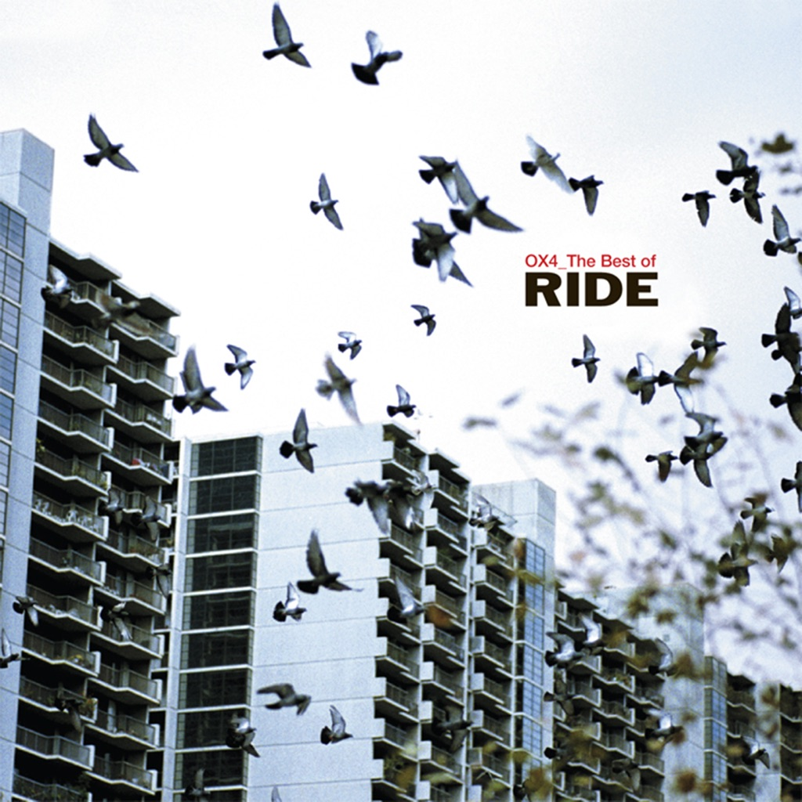

<!-- section break -->

1. Chelsea Girl
2. Drive Blind
3. Like A Daydream
4. Taste
5. Dreams Burn Down
6. Vapour Trail
7. Unfamiliar
8. Leave Them All Behind
9. Twisterella
10. OX4
11. Birdman
12. From Time To Time
13. How Does It Feel To Feel?
14. I Don't Know Where It Comes From
15. Black Nite Crash

<!-- section break -->

## Spotify


## Videos
### Ride - Like A Daydream
 

### More Videos

- [Ride - Leave Them All Behind](https://www.youtube.com/watch?v=gIsnb1TKYjE)

## Release Information
|  Key           | Value                                                |
| ---------------| ---------------------------------------------------- |
| Release Year   | 2015                                   |
| Discogs Link   | [Ride - OX4_ The Best Of Ride](https://www.discogs.com/release/6901033-Ride-OX4_-The-Best-Of-Ride) |
| Label          | Sire |
| Format         | Vinyl 2× LP Record Store Day Compilation Reissue (Red) |
| Catalog Number | 081227955137 |
| Notes | Exclusive to Record Store day 2015. Limited edition of 5000 red transparent vinyl. 15-track best-of collection originally released in 2001. Made in EU.  Pressing plant uncredited, identified by the three concentric rings near the spindle hole. |