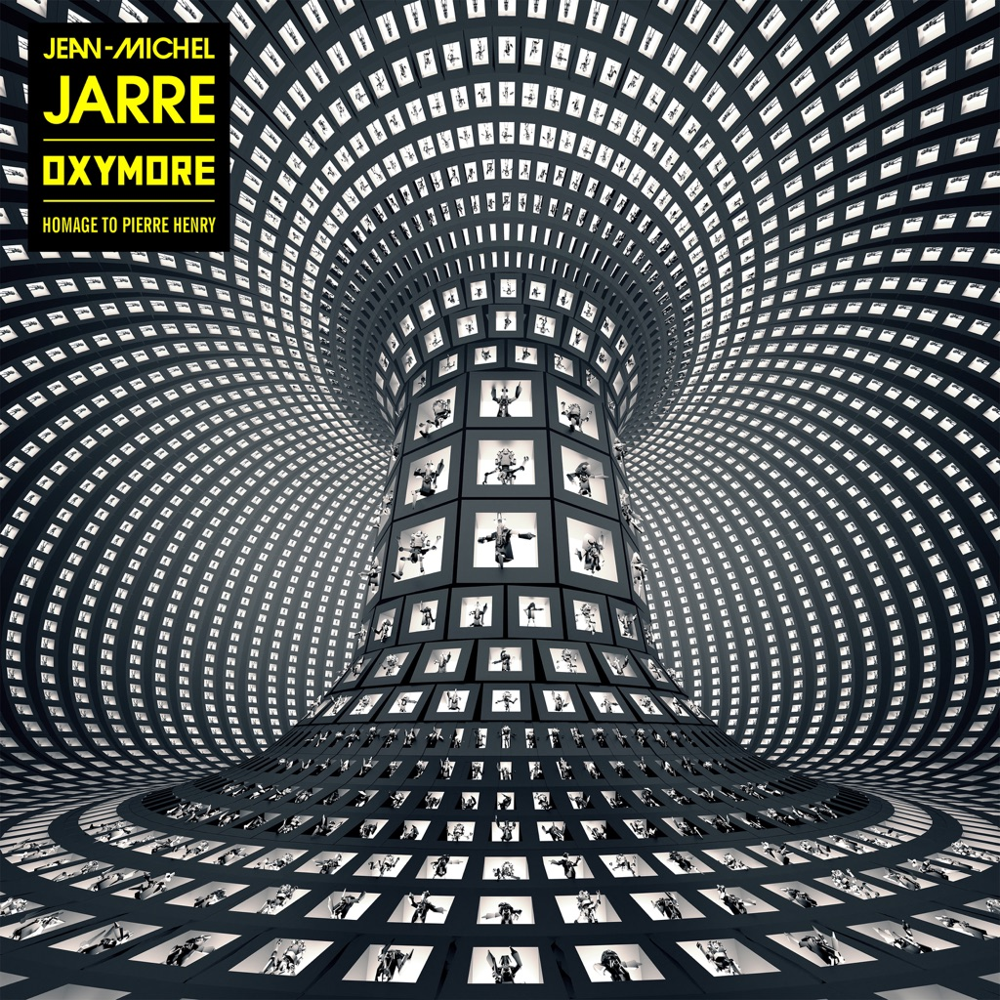

<!-- section break -->

1. Agora (1:34)
2. Oxymore (4:46)
3. Neon Lips (4:27)
4. Sonic Land (6:01)
5. Animal Genesis (5:46)
6. Synthy Sisters (3:20)
7. Sex In The Machine (5:45)
8. Zeitgeist (3:11)
9. Crystal Garden (4:09)
10. Brutalism (4:41)
11. Epica (5:25)

<!-- section break -->

## Spotify


## Videos
### OXYMORE
 

### More Videos

- [AGORA](https://www.youtube.com/watch?v=Jb-u4KeW7Zw)
- [NEON LIPS](https://www.youtube.com/watch?v=1sdXjw-ggd8)
- [SONIC LAND](https://www.youtube.com/watch?v=4WtegAy_-to)
- [ANIMAL GENESIS](https://www.youtube.com/watch?v=PyzpdcSZUcs)
- [SYNTHY SISTERS](https://www.youtube.com/watch?v=5RnfenugG7w)
- [SEX IN THE MACHINE](https://www.youtube.com/watch?v=3ZxaskBZz9g)
- [ZEITGEIST](https://www.youtube.com/watch?v=DE48f7-2daI)
- [CRYSTAL GARDEN](https://www.youtube.com/watch?v=h843xk2UQTI)
- [AGORA (Binaural Headphone Mix)](https://www.youtube.com/watch?v=oPKpe5zfXVs)
- [OXYMORE (Binaurel Headphone Mix)](https://www.youtube.com/watch?v=YVDktZ644iw)
- [NEON LIPS (Binaural Headphone Mix)](https://www.youtube.com/watch?v=Bpe9C0pZ4fk)
- [SONIC LAND (Binaural Headphone Mix)](https://www.youtube.com/watch?v=TYb2MfdUzf8)
- [ANIMAL GENESIS (Binaural Headphone Mix)](https://www.youtube.com/watch?v=Wtxr2c2hZuU)
- [SYNTHY SISTERS (Binaural Headphone Mix)](https://www.youtube.com/watch?v=oJdJHCy9Osg)
- [SEX IN THE MACHINE (Binaural Headphone Mix)](https://www.youtube.com/watch?v=QFbGxXdDdGI)
- [ZEITGEIST (Binaural Headphone Mix)](https://www.youtube.com/watch?v=eVTEy5xUMbA)
- [CRYSTAL GARDEN (Binaural Headphone Mix)](https://www.youtube.com/watch?v=TcRv_J1-v1c)
- [BRUTALISM (Binaural Headphone Mix)](https://www.youtube.com/watch?v=Pxj4mBZ5fJM)
- [EPICA (Binaurel Headphone Mix)](https://www.youtube.com/watch?v=Vj9_79BlZFE)
- [Jean Michel Jarre - Oxymore CD Album 2022 Sony Music EU Unboxing](https://www.youtube.com/watch?v=nqiRXZq8-mo)
- [Jean Michel Jarre - Oxymore 2xLP Album 2022 Sony Music Europe VINYL UNBOXING](https://www.youtube.com/watch?v=dgefMtRMuzM)

## Release Information
|  Key           | Value                                                |
| ---------------| ---------------------------------------------------- |
| Release Year   | 2022                                   |
| Discogs Link   | [Jean-Michel Jarre - Oxymore](https://www.discogs.com/release/24896663-Jean-Michel-Jarre-Oxymore) |
| Label          | Columbia |
| Format         | Vinyl 2× 12" 33 ⅓ RPM Album (180g) |
| Catalog Number | 19658746581 |
| Notes | Issued in a 6-panel trifold sleeve. Includes download link to binaural headphone version (in 24-Bit 48 kHz WAV) Originally comes with 2 stickers: Sticker 1: "Jean-Michel Jarre Oxymore Homage To Pierre Henry" Sticker 2 [french]: "An immersive music project + Accès à la version binaurale Double vinyle 180g, livret 32 pages _" Sticker 2 [english]: "An Immersive Music Project  + Access To Binaural Version!  2x180g Vinyl / 32 Page Booklet"  Homage To Pierre Henry [Back cover] ℗ & © 2022 Music Affair Entertainment Limited [Back cover] Made in the EU. [Back cover] Sounds of Pierre Henry courtesy of Pierre Henry Estate [Booklet] Dedicated to [a7209] and [a32181] [Booklet] |