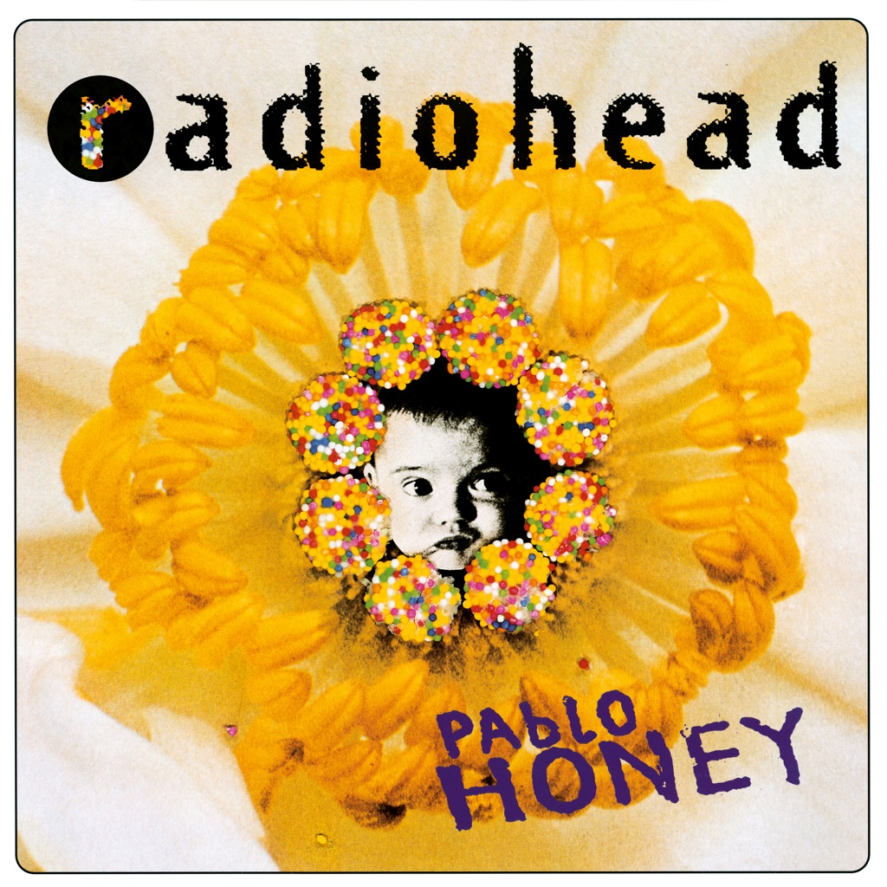

<!-- section break -->

1. You
2. Creep
3. How Do You?
4. Stop Whispering
5. Thinking About You
6. Anyone Can Play Guitar
7. Ripcord
8. Vegetable
9. Prove Yourself
10. I Can't
11. Lurgee
12. Blow Out

<!-- section break -->

## Spotify


## Release Information
|  Key           | Value                                                |
| ---------------| ---------------------------------------------------- |
| Release Year   | 2016                                   |
| Discogs Link   | [Radiohead - Pablo Honey](https://www.discogs.com/release/8765909-Radiohead-Pablo-Honey) |
| Label          | XL Recordings |
| Format         | Vinyl LP Album Misprint Reissue |
| Catalog Number | XLLP779 |
| Notes | Includes download coupon. Heavy pressed vinyl, but not marketed as 180g or suchlike. Slight misprint in inner sleeve where apostrophes in "I Can't" and "Ed O'Brien" have small vertical lines underneath. The [url=https://www.discogs.com/release/14120723] repress[/url] does not have these misprints on the inner sleeve Tracks A1, A2, A5, B3 & B5 ℗ 1992 - Tracks A3, A4, A6, B1, B2, B4 & B6 ℗  1993     |