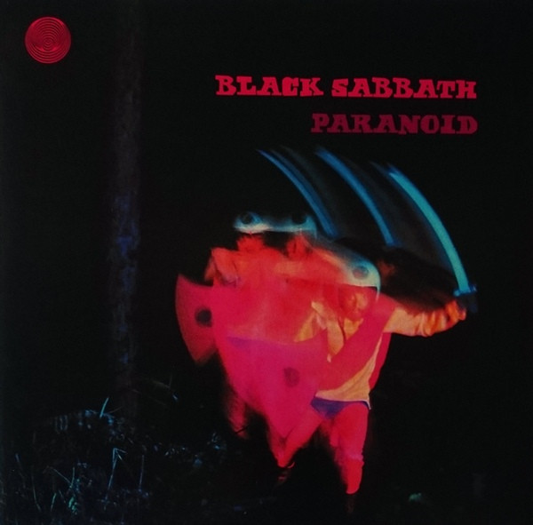

<!-- section break -->

1. War Pigs
2. Paranoid
3. Planet Caravan
4. Iron Man
5. Electric Funeral
6. Hand Of Doom
7. Rat Salad
8. Fairies Wear Boots
9. War Pigs
10. Paranoid
11. Planet Caravan
12. Iron Man
13. Electric Funeral
14. Hand Of Doom
15. Rat Salad
16. Fairies Wear Boots

<!-- section break -->

## Spotify


## Videos
### Planet Caravan (2012 - Remaster)
 

### More Videos

- [War Pigs / Luke's Wall (2012 - Remaster)](https://www.youtube.com/watch?v=lLb6UUw2ZVQ)
- [BLACK SABBATH - Paranoid (Full Album)](https://www.youtube.com/watch?v=fWvKvOViM3g)
- [BLACK SABBATH - Paranoid (Official Video)](https://www.youtube.com/watch?v=0qanF-91aJo)
- [Iron Man (2012 - Remaster)](https://www.youtube.com/watch?v=b3-QqGVt-tM)
- [Electric Funeral (2012 - Remaster)](https://www.youtube.com/watch?v=ZyEUk1ZJLn4)
- [Hand of Doom (2012 - Remaster)](https://www.youtube.com/watch?v=o6HmfTdwYZg)
- [Rat Salad (2012 - Remaster)](https://www.youtube.com/watch?v=RLlU-5GqLvo)

## Release Information
|  Key           | Value                                                |
| ---------------| ---------------------------------------------------- |
| Release Year   | 2015                                   |
| Discogs Link   | [Black Sabbath - Paranoid](https://www.discogs.com/release/7161194-Black-Sabbath-Paranoid) |
| Label          | Sanctuary |
| Format         | Vinyl LP Album Reissue, CD Album Reissue |
| Catalog Number | BMGRM054LP |
| Notes | Issued in a gatefold cover. Includes a CD of the album in a clear plastic sleeve.  Sticker on shrink-wrap reads: Includes CD of Album    Vertigo swirl on top left of front cover.  Vertigo swirl on side A disc label.    Recorded at Regent Sound and Island Studios  Management/Jim Simpson, Big Bear, Birmingham    ℗ 2015 Sanctuary Records Group Ltd., a BMG Company, under sxclusive licence to [PIAS]  © 2015 Sanctuary Records Group Ltd., a BMG Company, under sxclusive licence to [PIAS]  Use of the Vertigo logos and trademarks by kind permission of the Universal Music Group.  Made in EU     |