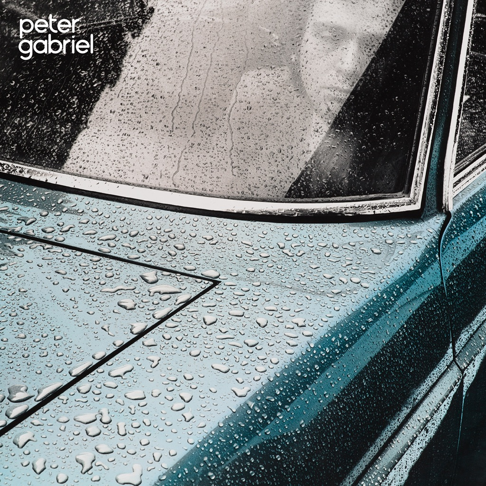

<!-- section break -->

1. Rhythm Of The Heat
2. San Jacinto
3. I Have The Touch
4. The Family And The Fishing Net
5. Shock The Monkey
6. Lay Your Hands On Me
7. Wallflower
8. Kiss Of Life

<!-- section break -->

## Spotify


## Release Information
|  Key           | Value                                                |
| ---------------| ---------------------------------------------------- |
| Release Year   | 2016                                   |
| Discogs Link   | [Peter Gabriel - Peter Gabriel ](https://www.discogs.com/release/9473573-Peter-Gabriel-Peter-Gabriel-) |
| Label          | Real World Records |
| Format         | Vinyl LP Album Reissue Remastered Stereo (180 grams) |
| Catalog Number | PGLPR4 |
| Notes | ℗ 2016 Peter Gabriel Ltd. © 2016 Peter Gabriel Ltd.  Half-Speed Remaster + Hi-Res Download Code.  Matrices in runouts are etched: "14551 1A 008841080041180" and "14551 1B 008841080041180" are stamped. |