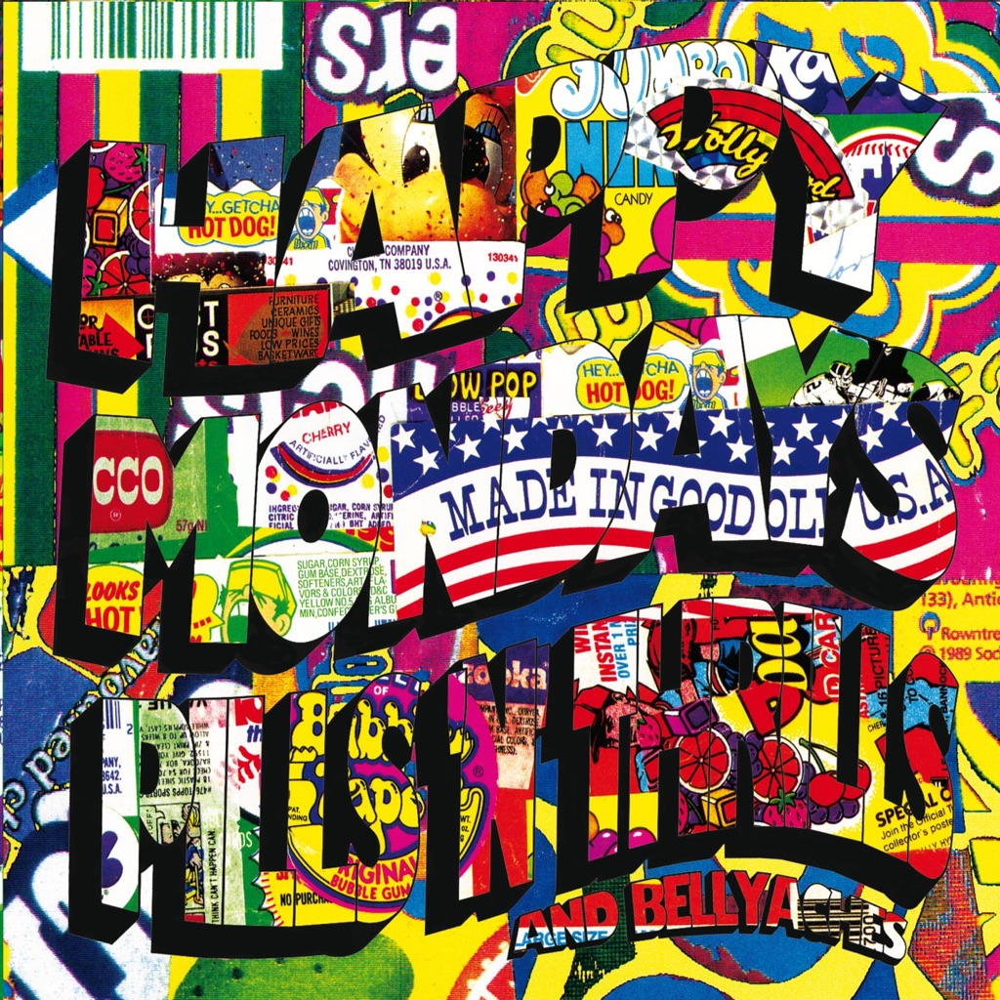

<!-- section break -->

1. Kinky Afro
2. God's Cop
3. Donovan
4. Grandbag's Funeral
5. Loose Fit
6. Dennis And Lois
7. Bob's Yer Uncle
8. Step On
9. Holiday
10. Harmony

<!-- section break -->

## Spotify


## Videos
### Happy Mondays - Loose Fit (Official Music Video)
 

### More Videos

- [Happy Mondays - Step On (Official Music Video)](https://www.youtube.com/watch?v=mFBQ0PH5rM4)
- [Happy Mondays - Kinky Afro (Official Video)](https://www.youtube.com/watch?v=O8maBsuhHr4)

## Release Information
|  Key           | Value                                                |
| ---------------| ---------------------------------------------------- |
| Release Year   | 2015                                   |
| Discogs Link   | [Happy Mondays - Pills 'N' Thrills And Bellyaches](https://www.discogs.com/release/6913456-Happy-Mondays-Pills-N-Thrills-And-Bellyaches) |
| Label          | Rhino Records (2) |
| Format         | Vinyl LP Album Record Store Day Limited Edition Reissue (Yellow) |
| Catalog Number | R1 60986 |
| Notes | 25th Anniversary edition, released on Record Store Day 2015. Mastered from the original tapes on limited edition 180 gram yellow vinyl.  Published by London Music Ltd. except B3 published by Tapestry Music Ltd. © 1970 |