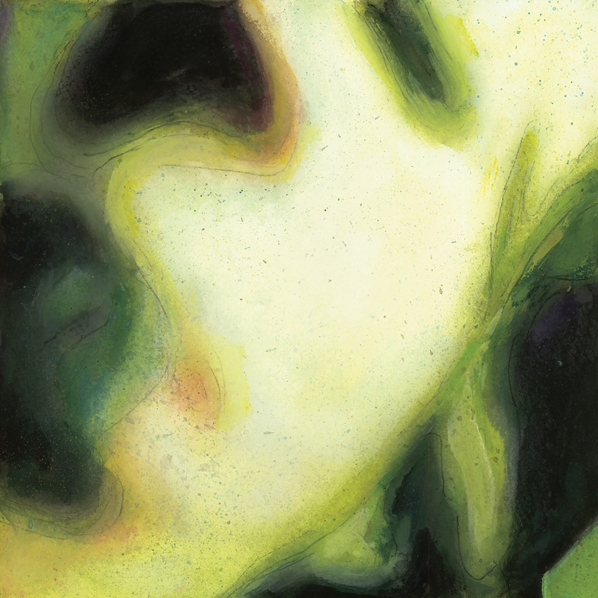

<!-- section break -->

1. Soothe
2. Frail And Bedazzled
3. Plume
4. Whir
5. Blew Away
6. Pissant
7. Hello Kitty Kat
8. Obscured
9. Landslide
10. Starla
11. Blue
12. Girl Named Sandoz
13. La Dolly Vita
14. Spaced

<!-- section break -->

## Spotify


## Release Information
|  Key           | Value                                                |
| ---------------| ---------------------------------------------------- |
| Release Year   | 2012                                   |
| Discogs Link   | [The Smashing Pumpkins - Pisces Iscariot](https://www.discogs.com/release/4225337-Smashing-Pumpkins-Pisces-Iscariot) |
| Label          | Virgin |
| Format         | Vinyl 2× LP Reissue Remastered Compilation (180 gram) |
| Catalog Number | 5099946425416 |
| Notes | "Printed in the EU" on sleeve rear. (European Union) --------------------------------------------------- Reissue Produced by Billy Corgan Project Management: Bjorn Thorarud, Rynda Laurel, Michael Murphy Vinyl Mastering by Stan Getz at A&R Reissue Art Direction/Design: Noel Waggener Illustrations: Satch Grimley Legal Oversight: Jill Berliner --------------------------------------------------- Original Pisces Iscariot Packaging and Photographing: Billy Corgan & Michael Meister. Original Pisces Iscariot Design Assistance: Rachel Gutek  ℗ 2012 The copyright of this sound recording is owned by Virgin Records America, Inc. © 2012 Virgin Records America, Inc. 5099946425416 --------------------------------------------------- All songs written by Billy Corgan, except "Plume" written by Billy Corgan and James Iha, "Blew Away" written by James Iha, "Landslide" written by Stevie Nicks, "Girl Named Sandoz" written by Eric Burdon/John Weider.   Produced by Butch Vig and Billy Corgan, except "Plume" and "Starla" produced by Billy Corgan and Kerry Brown; "Soothe" produced by Billy Corgan; "Blew Away" produced by James Iha and Kerry Brown; "Landslide" produced by Ted de Bono; "Girl Named Sandoz" produced by Dale Griffin.   All songs published by Cinderful Music/Chrysalis Songs (BMI); except "Landslide" published by Welsh Witch Music/Sony Songs Inc. (BMI); "Girl Named Sandoz" published by Unichappell Music, Inc. (BMI).   "Landslide" released by arrangement with BBC Enterprises Ltd.  --------------------------------------------------- Printed inner sleeves contains lyric sheet and details/notes on the songs from Billy Corgan. Written February 12, 2012 specifically for the reissue.  Pressed By information is not listed. Information derived from runouts.  |