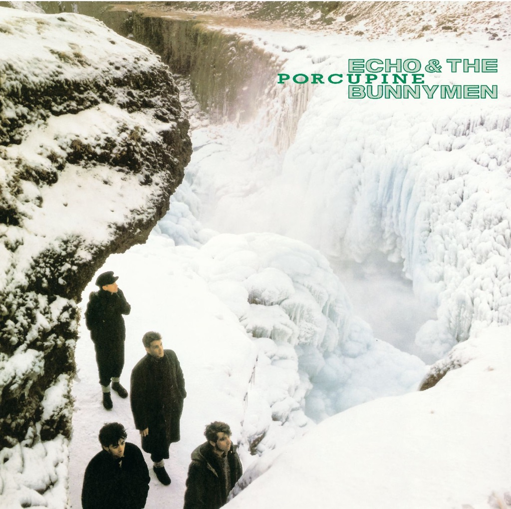

<!-- section break -->

1. The Cutter (3:50)
2. Back Of Love (3:12)
3. My White Devil (4:30)
4. Clay (4:10)
5. Porcupine (5:55)
6. Heads Will Roll (3:28)
7. Ripeness (4:46)
8. Higher Hell (5:00)
9. Gods Will Be Gods (4:10)
10. In Bluer Skies (5:55)

<!-- section break -->

## Spotify


## Videos
### Ripeness
 

### More Videos

- [Echo And The Bunnymen - The Cutter HD](https://www.youtube.com/watch?v=nMplIrSlg8E)
- [Back of Love](https://www.youtube.com/watch?v=W5O-F0s8CzU)
- [My White Devil](https://www.youtube.com/watch?v=eSfGEaxSdEQ)
- [Clay](https://www.youtube.com/watch?v=fRKwNcYbbkQ)
- [Porcupine](https://www.youtube.com/watch?v=bUdyUqhivug)
- [Heads Will Roll](https://www.youtube.com/watch?v=wo87VUG-F54)
- [Higher Hell](https://www.youtube.com/watch?v=CMh55H3K8fY)
- [Gods Will Be Gods](https://www.youtube.com/watch?v=HJKhtrbVsl4)
- [In Bluer Skies](https://www.youtube.com/watch?v=xtzzHeeLR3E)

## Release Information
|  Key           | Value                                                |
| ---------------| ---------------------------------------------------- |
| Release Year   | 1983                                   |
| Discogs Link   | [Echo & The Bunnymen - Porcupine](https://www.discogs.com/release/374614-Echo-The-Bunnymen-Porcupine) |
| Label          | Korova |
| Format         | Vinyl LP Album |
| Catalog Number | KODE 6 |
| Notes | First pressing released without barcode on sleeve and with credits printed on a polylined liner. KODE 6 only on labels; also 240027-1 on inner and rear sleeve, 24.0027-1 on spine.  A limited number of the first UK pressing included a free five track cassette. This was the same cassette as given away with some copies of the "The Cutter" 7" single that was released at about the same time.   ℗&© 1983 WEA Records Ltd.  ZOO MANAGEMENT c/o Korova Records 17 Berners Street London, West One   "PINING FOR THE PORK OF THE PORCUPINE"  Manufactured in Germany ---------------- Mastering credit derived from matrix. Runouts have the matrices stamped and etched, the 2-digit number and 'RAYS' is etched, the main string is stamped. |