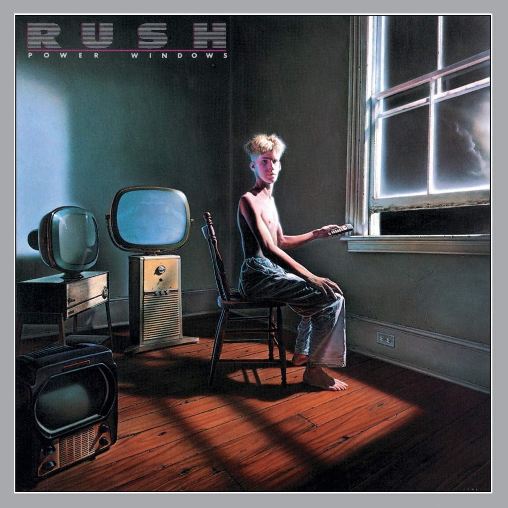

<!-- section break -->

1. The Big Money
2. Grand Designs
3. Manhattan Project
4. Marathon
5. Territories
6. Middletown Dreams
7. Emotion Detector
8. Mystic Rhythms

<!-- section break -->

## Spotify


## Release Information
|  Key           | Value                                                |
| ---------------| ---------------------------------------------------- |
| Release Year   | 2015                                   |
| Discogs Link   | [Rush - Power Windows](https://www.discogs.com/release/7855875-Rush-Power-Windows) |
| Label          | Mercury |
| Format         | Vinyl LP Album Reissue (180 Gram) |
| Catalog Number | 00602547118288 |
| Notes | Including a voucher to download an MP4 version of the album.   |