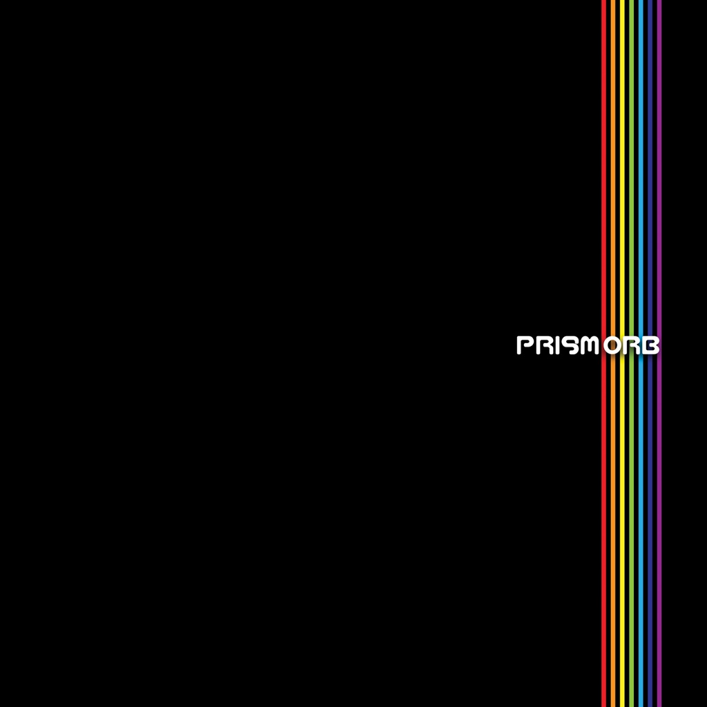

<!-- section break -->

1. H.O.M.E. (High Orbs Mini Earths)
2. Why Can You Be In Two Places @ Once When You're Not Anywhere At All... Where's Gary Mix
3. A Ghetto Love Story
4. Picking Tea Leaves & Chasing Butterflies
5. Tiger
6. Dragon Of The Ocean (Dogon Mix)
7. The Beginning Of The End
8. Living In Recycled Times
9. Prism

<!-- section break -->

## Spotify


## Videos
### the beginning of the end
 

### More Videos

- [The Orb - Prism](https://www.youtube.com/watch?v=CsPENyMyKcw)
- [The Orb - living in recycled times (feat. Rachel D'Arcy)](https://www.youtube.com/watch?v=zdlIv-0vvwY)
- [The Orb - H.O.M.E (high orbs mini earths)](https://www.youtube.com/watch?v=_KZfmTLCNX8)
- [The Orb - why can you be in two places at once, when you can’t be anywhere at all.. where’s gary mix](https://www.youtube.com/watch?v=g-1LU0puPCo)

## Release Information
|  Key           | Value                                                |
| ---------------| ---------------------------------------------------- |
| Release Year   | 2023                                   |
| Discogs Link   | [The Orb - Prism](https://www.discogs.com/release/26908850-Orb-Prism) |
| Label          | Cooking Vinyl |
| Format         | Vinyl 2× LP Album Limited Edition (Citrus) |
| Catalog Number | COOKLP865X |
| Notes | Limited edition citrus coloured vinyl  Cat# on sticker: COOKLP865X Cat# on sleeve and labels: COOKLP865  Additional credits: Sauces: King Michael (Johnson) Psychic Adviser: Youth Orb Concert Agent: Ian @ X Ray |