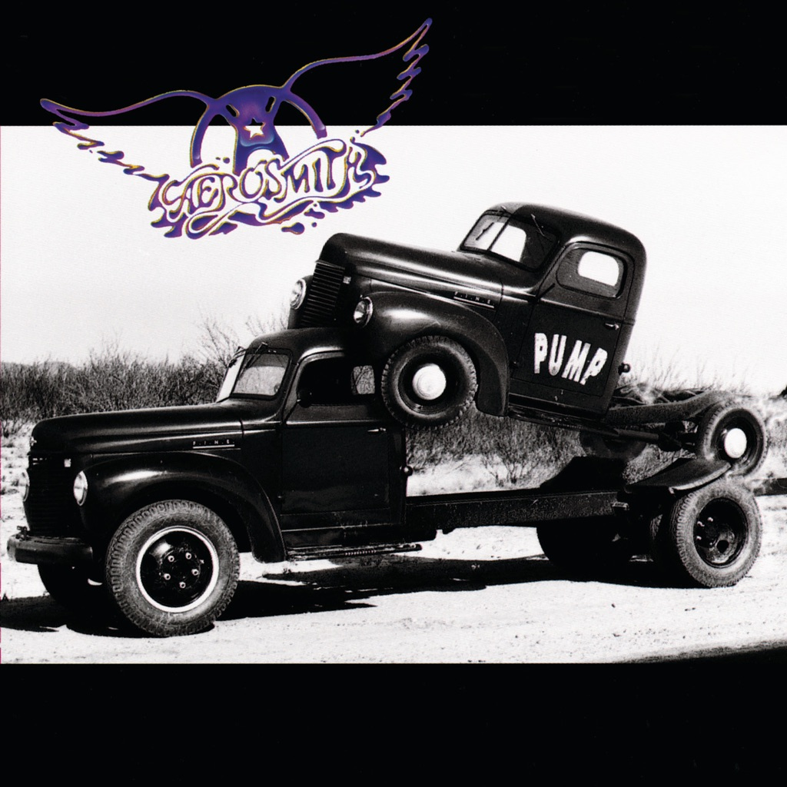

<!-- section break -->

1. Young Lust (4:19)
2. F.I.N.E. (4:10)
3. Love In An Elevator (5:39)
4. Monkey On My Back (3:57)
5. Janie's Got A Gun (5:33)
6. The Other Side (4:57)
7. My Girl (3:10)
8. Don't Get Mad, Get Even (4:50)
9. Voodoo Medicine Man (4:39)
10. What It Takes (6:26)

<!-- section break -->

## Spotify


## Release Information
|  Key           | Value                                                |
| ---------------| ---------------------------------------------------- |
| Release Year   | 2016                                   |
| Discogs Link   | [Aerosmith - Pump](https://www.discogs.com/release/9474092-Aerosmith-Pump) |
| Label          | Geffen Records |
| Format         | Vinyl LP Album Reissue (180 Gram) |
| Catalog Number | 00602547954381 |
| Notes | Recorded at Little Mountain Sound Studios, Vancouver, B.C., Canada Mastered at Artisan Sound Recorders, Los Angeles, CA  ℗ 1989 © 2016 Geffen Records. Made in the E.U. Universal International B.V. Gerrit Van Der Veenlaan  Issued with a printed inner sleeve. Includes a voucher to download MP3 version of the album.  There's also the [url=https://www.discogs.com/release/9294317]US release[/url] issued a month earlier |