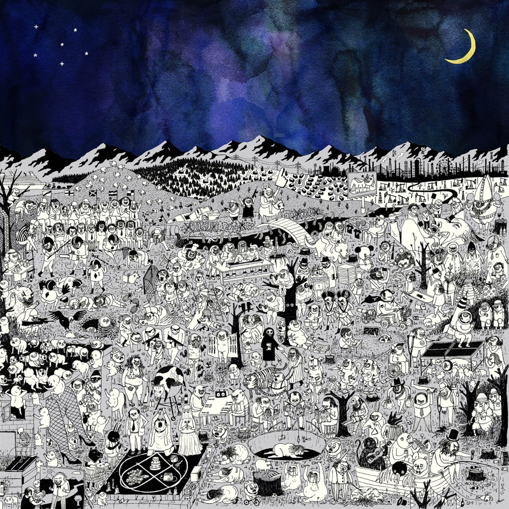

<!-- section break -->

1. Pure Comedy
2. Total Entertainment Forever
3. Things It Would Be Helpful To Know Before The Revolution
4. Ballad Of The Dying Man
5. Birdie
6. Leaving LA
7. A Bigger Paper Bag
8. When The God Of Love Returns There'll Be Hell To Pay
9. Smoochie
10. Two Wildly Different Perspectives
11. The Memo
12. So I’m Growing Old On Magic Mountain
13. In Twenty Years Or So
14. Real Love Baby
15. Rejected Generic Pop Song March '15 #3

<!-- section break -->

## Spotify


## Videos
### Father John Misty - Pure Comedy [FULL ALBUM STREAM]
 

### More Videos

- [Father John Misty - Pure Comedy [Official Music Video]](https://www.youtube.com/watch?v=wKrSYgirAhc)
- [Father John Misty - Things It Would Have Been Helpful To Know Before The Revolution [OFFICIAL VIDEO]](https://www.youtube.com/watch?v=cIsT3dJ60Uk)

## Release Information
|  Key           | Value                                                |
| ---------------| ---------------------------------------------------- |
| Release Year   | 2017                                   |
| Discogs Link   | [Father John Misty - Pure Comedy](https://www.discogs.com/release/10089067-Father-John-Misty-Pure-Comedy) |
| Label          | Bella Union |
| Format         | Vinyl 2× LP Album Deluxe Edition (Aluminium/Copper), Vinyl 7", All Media Limited Edition |
| Catalog Number | BELLA628VX |
| Notes | Released in a die-cut customizable gatefold sleeve with 4 interactive “background” sleeves, with clear slipcase over. Includes a fold-out poster and an exclusive holographic tarot card by Ed Steed, and download code. Tracklisting, barcode and copyrights are printed on a large sticker affixed to the shrinkwrap. LP1 is aluminium, LP2 is copper.  Pre-orders and initial copies sold in stores came with this limited edition bonus 7".  Very special thanks to Gavin Bryars and Ed Steed.  Published by Cripple Creek Fairies (ASCAP) / Kobalt Music Publishing.  ℗ & © Bella Union & 2017 Under exclusive license to [PIAS] |