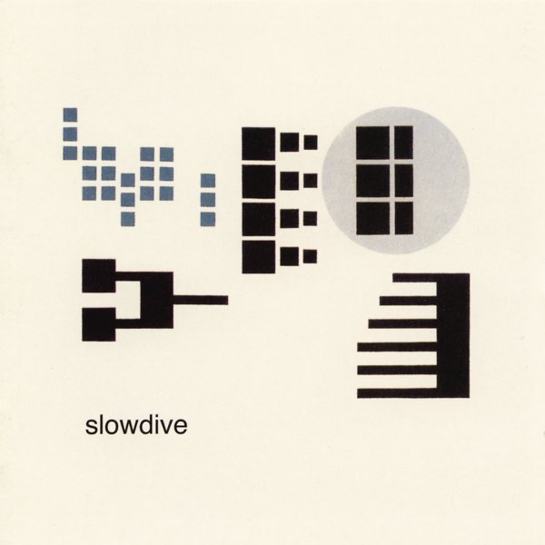

<!-- section break -->

1. Rutti (10:05)
2. Crazy For You (6:01)
3. Miranda (4:49)
4. Trellisaze (6:22)
5. Cello (1:42)
6. J's Heaven (6:47)
7. Visions Of La (1:48)
8. Blue Skied An' Clear (6:54)
9. All Of Us (4:07)

<!-- section break -->

## Spotify


## Videos
### Blue Skied An' Clear
 

### More Videos

- [Rutti](https://www.youtube.com/watch?v=X3UmjDqF0lc)
- [Crazy for You (Alternative Version (Demo Version))](https://www.youtube.com/watch?v=_4jYMIx0HHU)
- [Slowdive-Option One (Instrumental #1)](https://www.youtube.com/watch?v=Xc5DpJprI_E)
- [Crazy for You](https://www.youtube.com/watch?v=fb4MRvJ6NXw)
- [Miranda](https://www.youtube.com/watch?v=D5BuFce-Ro4)
- [Trellisaze](https://www.youtube.com/watch?v=oDEG7-MKaTI)
- [Cello](https://www.youtube.com/watch?v=cjpxk3vL8iY)
- [J's Heaven](https://www.youtube.com/watch?v=Rrwdr7B_wtk)
- [Visions Of LA](https://www.youtube.com/watch?v=HnDpEOfQONk)
- [All Of Us](https://www.youtube.com/watch?v=kYeMBYsEWRo)

## Release Information
|  Key           | Value                                                |
| ---------------| ---------------------------------------------------- |
| Release Year   | 2020                                   |
| Discogs Link   | [Slowdive - Pygmalion](https://www.discogs.com/release/15765429-Slowdive-Pygmalion) |
| Label          | Music On Vinyl |
| Format         | Vinyl LP Album Numbered Reissue Repress (Clear & Green Marbled, 180 Gram) |
| Catalog Number | MOVLP604 |
| Notes | 25th aniversary edition. Comes in a thick sleeve with alubrushed finish. Includes insert with photos and credits. Released in a clear plastic resealable sleeve with info sticker. Edition of 3000 copies.  Recorded at Courtyard Studio, Sutton Courtney, Nr Abingdon.  Originally ℗ & © 1995 Creation Records Limited. This release ℗ & © 2012 Sony Music Entertainment. Manufactured & distributed by Music On Vinyl B.V. for Sony Music Entertainment. Made in the EU |