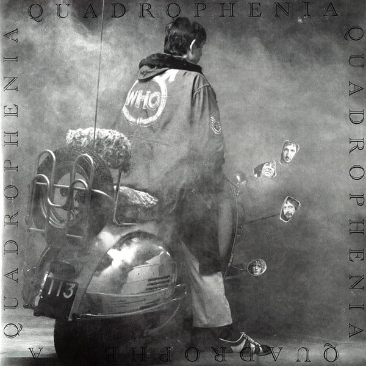

<!-- section break -->

1. I Am The Sea
2. The Real Me
3. Quadrophenia
4. Cut My Hair
5. The Punk And The Godfather
6. I'm One
7. The Dirty Jobs
8. Helpless Dancer
9. Is It In My Head
10. I've Had Enough
11. 5.15
12. Sea And Sand
13. Drowned
14. Bell Boy
15. Doctor Jimmy
16. The Rock
17. Love Reign O'er Me

<!-- section break -->

## Spotify


## Release Information
|  Key           | Value                                                |
| ---------------| ---------------------------------------------------- |
| Release Year   | 2011                                   |
| Discogs Link   | [The Who - Quadrophenia](https://www.discogs.com/release/3353094-The-Who-Quadrophenia) |
| Label          | Track Record |
| Format         | Vinyl 2× LP Album Reissue Remastered Stereo (180g, Gatefold) |
| Catalog Number | 2780504 |
| Notes | Also repressed in 2015 with the same GZ media stampers. For the 2019 reissue cut at Abbey Road, please refer to [r=15106941]. The gatefold sleeve includes also a 44-page booklet.  Made in the E.U.  ℗© 1973 Polydor Ltd. UK.  Record 1 has the catalog number "2780505" on both labels. Record 2 has the catalog number "2780506" on both labels.  Text on back sleeve: This music is dedicated to the kids of Goldhawk Road, Carpenders Park, Forest Hill, Stevenage New Town and to all the people we played to at the Marquee and Brighton Aquarium in the summer of '65.  Recorded at The Kitchen in Thessally Road, Battersea, while building was still in progress. Ronnie Lane's Mobile Sound served as control room while ours was being finished. Mixed at Eel Pie Sound. Mastered, the Mastering Lab, Los Angeles.  Runouts are mostly stamped, "Ⓜ MILES" etched. |