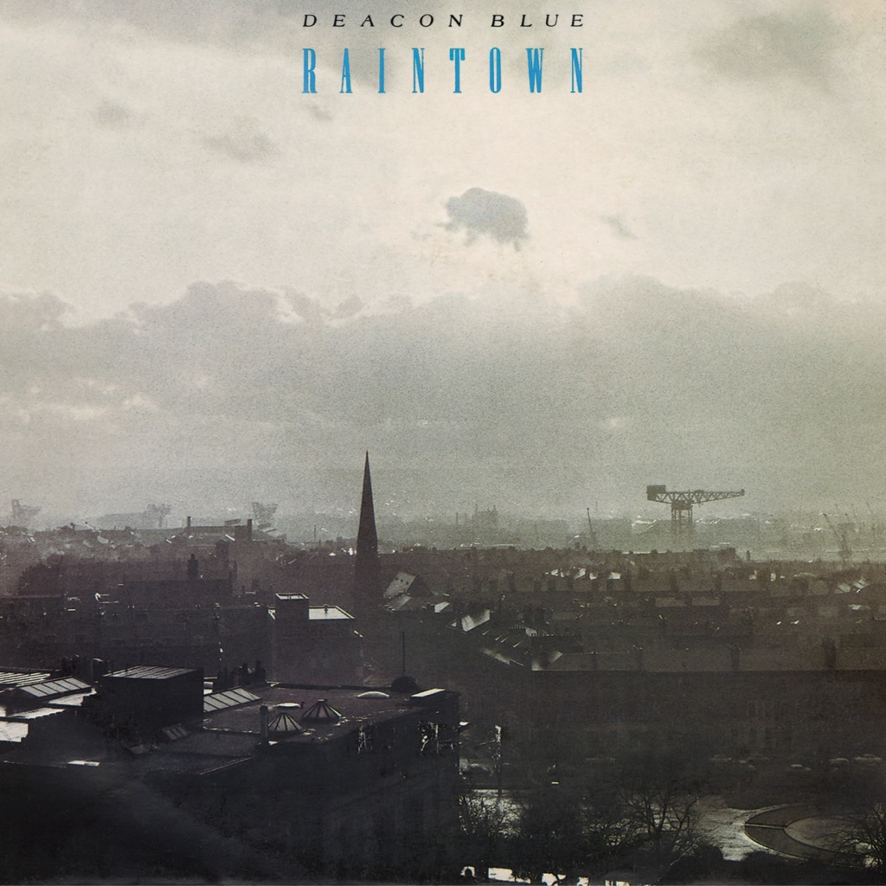

<!-- section break -->

1. Born In A Storm (1:35)
2. Raintown (3:48)
3. Ragman (3:10)
4. He Looks Like Spencer Tracey Now (3:50)
5. Loaded (4:30)
6. When Will You (Make My Telephone Ring) (5:03)
7. Chocolate Girl (3:15)
8. Dignity (3:55)
9. The Very Thing (3:32)
10. Love's Great Fears (3:40)
11. Town To Be Blamed (5:20)

<!-- section break -->

## Spotify


## Videos
### Town to Be Blamed
 

### More Videos

- [Born in a Storm](https://www.youtube.com/watch?v=xahuOCodtL0)
- [Deacon Blue - Chocolate girl HQ](https://www.youtube.com/watch?v=fOrOh3rEwB4)
- [Born in a Storm](https://www.youtube.com/watch?v=GlJ4XYVvqPQ)
- [Raintown](https://www.youtube.com/watch?v=RckKerR6MI8)
- [Ragman](https://www.youtube.com/watch?v=SE4MpZtgdJQ)
- [He Looks Like Spencer Tracy Now](https://www.youtube.com/watch?v=d6ujXpWJ__0)
- [Deacon Blue - He Looks like Spencer Tracy Now](https://www.youtube.com/watch?v=hqoc8CLNptk)
- [Loaded (Remastered 2005)](https://www.youtube.com/watch?v=u-ibwaIdrzM)
- [Deacon Blue - Loaded](https://www.youtube.com/watch?v=NsjDnLII1Go)
- [When Will You (Make My Telephone Ring) (Air Studios Vocal Mix)](https://www.youtube.com/watch?v=1e87yslPJBY)
- [Deacon Blue - When Will You (Make My Telephone Ring)?](https://www.youtube.com/watch?v=sWSi5MMEIOA)
- [Chocolate Girl](https://www.youtube.com/watch?v=R-bWRzyJaE0)
- [Deacon Blue - Chocolate Girl](https://www.youtube.com/watch?v=EjhfH5P5ZEM)
- [Dignity](https://www.youtube.com/watch?v=Wru7g5pn3jw)
- [Deacon Blue - Dignity](https://www.youtube.com/watch?v=nsr9HCOgQe0)
- [The Very Thing](https://www.youtube.com/watch?v=4h6NLkEBD1Q)
- [Love's Great Fears](https://www.youtube.com/watch?v=wCsGgUzhR1E)
- [Deacon Blue - Love's great fears](https://www.youtube.com/watch?v=9W_JM_NDYzI)
- [Town to Be Blamed](https://www.youtube.com/watch?v=KQctwZ0yFfI)
- [Riches](https://www.youtube.com/watch?v=zJ48Sppm9Co)
- [Kings Of The Western World](https://www.youtube.com/watch?v=1lZbCUtUdAo)

## Release Information
|  Key           | Value                                                |
| ---------------| ---------------------------------------------------- |
| Release Year   | 1987                                   |
| Discogs Link   | [Deacon Blue - Raintown](https://www.discogs.com/release/2313799-Deacon-Blue-Raintown) |
| Label          | CBS |
| Format         | Vinyl LP Album |
| Catalog Number | CBS 450549 1 |
| Notes | ℗ © 1987 CBS Records |