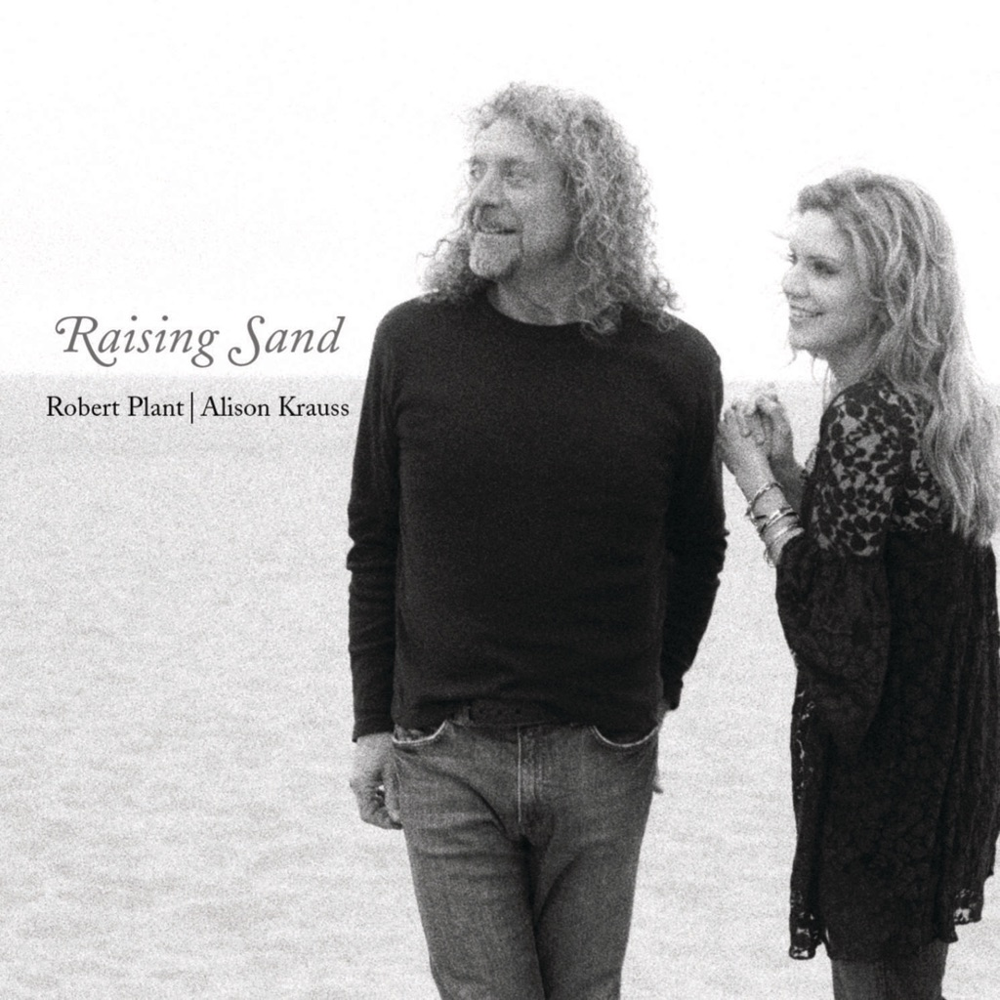

<!-- section break -->

1. Rich Woman (4:04)
2. Killing The Blues (4:16)
3. Sister Rosetta Goes Before Us (3:26)
4. Polly Come Home (5:36)
5. Gone Gone Gone (Done Moved On) (3:33)
6. Through The Morning, Through The Night (4:01)
7. Please Read The Letter (5:53)
8. Trampled Rose (5:34)
9. Fortune Teller (4:30)
10. Stick With Me Baby (2:50)
11. Nothin’ (5:33)
12. Let Your Loss Be Your Lesson (4:02)
13. Your Long Journey (3:55)

<!-- section break -->

## Spotify


## Videos
### Stick with Me Baby
 

### More Videos

- [Killing The Blues by Robert Plant & Alison Krauss from Raising Sand](https://www.youtube.com/watch?v=gwg2sdRdahM)
- [Sister Rosetta Goes Before Us](https://www.youtube.com/watch?v=zOFSHo92SmY)
- [Polly Come Home](https://www.youtube.com/watch?v=nF70owndla8)
- [Robert Plant & Alison Krauss - Gone Gone Gone (Done Moved On)](https://www.youtube.com/watch?v=3DT7pzJPybM)
- [Robert Plant & Alison Krauss - Through The Morning Through The Night](https://www.youtube.com/watch?v=AZjVCsSI0OM)
- [Robert Plant & Alison Krauss - Please Read The Letter](https://www.youtube.com/watch?v=rjs0p5FWpzc)
- [Trampled Rose](https://www.youtube.com/watch?v=9Ewg_bP20LI)
- [Fortune Teller](https://www.youtube.com/watch?v=7FFZkSpjPIo)
- [Nothin'](https://www.youtube.com/watch?v=zrLmkbjgorU)
- [Let Your Loss Be Your Lesson](https://www.youtube.com/watch?v=j1ztTFbyHmA)
- [Robert Plant & Alison Krauss - Your Long Journey](https://www.youtube.com/watch?v=eG_rArV84iY)

## Release Information
|  Key           | Value                                                |
| ---------------| ---------------------------------------------------- |
| Release Year   | 2007                                   |
| Discogs Link   | [Robert Plant - Raising Sand](https://www.discogs.com/release/1272003-Robert-Plant-Alison-Krauss-Raising-Sand) |
| Label          | Rounder Records |
| Format         | Vinyl 2× LP Album (Gatefold) |
| Catalog Number | 11661-9075-1 |
| Notes | 1st vinyl edition ℗ & © 2007 Rounder Records Corp.  Published By: A1: © 1955 Sony/ATV Songs LLC/Venice Music (BMI) A2: Graph Music (ASCAP) A3: © Eden Bridge Music (ASCAP) administered by Bug Music  A4: © 1969 Irving Music, Inc. (BMI) B1: © 1964 Sony/ATV Songs LLC/Acuff Rose Music (BMI) B2: © 1969 Irving Music, Inc. (BMI) B3: © BMG Songs (ASCAP)/BMG Music Publishing International Ltd. (PRS)/Sons Of Einion Limited (PRS)/Succubus Music Ltd. (PRS). All rights for the U.S. on behalf of BMG Songs. Administered by BMG Songs. C1: Jalma Music (ASCAP) C2: © 1962 renewed 1990 Unart Music Corporation. Rights assigned to EMI Catalogue Partnership. All rights controlled and administered by EMI Unart Catalog Inc. (BMI) C3: © 1960 Universal-Cedarwood Publ. (BMI) D1: © 1970 1999 (renewed) JTVZ Music (ASCAP)/Katie Belle Music (ASCAP)/Will Van Zandt Publishing (ASCAP) administered by Bug D2: © 2000 Trice Publishing Co. (BMI) D3: Hillgreen Music (BMI)  Both vinyls are housed in 140 gage square plastic polythene bags |