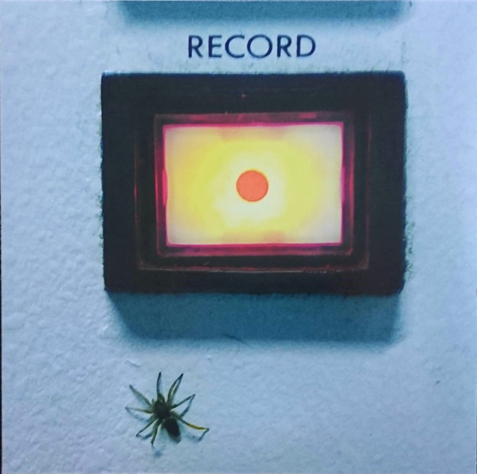

<!-- section break -->

1. Kaleidoscope
2. Repeater
3. Crystal Ball
4. Chase Away
5. Spaceman
6. Sunriders
7. Never and Always
8. Close

<!-- section break -->

## Release Information
|  Key           | Value                                                |
| ---------------| ---------------------------------------------------- |
| Release Year   | 2017                                   |
| Discogs Link   | [Amplifier - Record + Sunriders](https://www.discogs.com/release/11285242-Amplifier-Record-Sunriders) |
| Label          | Rockosmos |
| Format         | Vinyl LP Compilation |
| Catalog Number | ROK 31 |
| Notes | This is a split 180g Black Vinyl with Record on Side A and Sunriders on Side B. Edition of 500.  Sunriders EP - Recorded January 2013 Recorded At Loudhailer Manchester by Mladen Pavlovic All songs by Balamir, except Spaceman by Evans / Balamir  |