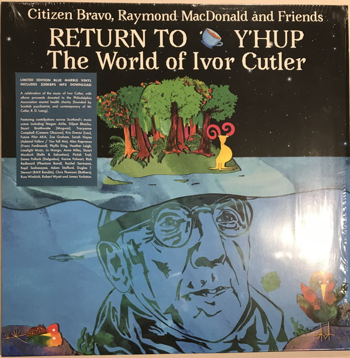

<!-- section break -->

1. Here's A Health For Simon
2. Latitude And Longitude
3. Size Nine And A Half
4. Mary's A Cow
5. Instance The Yam
6. Pickle Your Knees
7. Gravity Begins At Home
8. A Cowpuncher And A Bird
9. Boo Boo Bird
10. Vitamin P
11. Green Rain
12. A Tooth Song
13. Sh Chi
14. Women Of The World
15. A Real Man
16. Yellow Fly
17. Shoplifters
18. The Path
19. Muscular Tree
20. Who Tore Your Trousers James?
21. I Got No Common Sense
22. When I Stand Out In An Open Cart
23. I Believe In Bugs
24. Good Morning! How Are You? Shut Up!
25. Out Of Decency
26. Beautiful Cosmos

<!-- section break -->

## Videos
### Ivor Cutler Here's A Health For Simon (performed by Citizen Bravo, Raymond MacDonald and Friends)
 

### More Videos

- [Out of Decency](https://www.youtube.com/watch?v=AN_3nCGTbKo)

## Release Information
|  Key           | Value                                                |
| ---------------| ---------------------------------------------------- |
| Release Year   | 2020                                   |
| Discogs Link   | [Citizen Bravo, Raymond MacDonald And Friends - Return To Y'Hup The World Of Ivor Cutler](https://www.discogs.com/release/14702777-Citizen-Bravo-Raymond-MacDonald-And-Friends-Return-To-YHup-The-World-Of-Ivor-Cutler) |
| Label          | Chemikal Underground Records |
| Format         | Vinyl LP Album Limited Edition (Blue Marble) |
| Catalog Number | CHEM255 |
