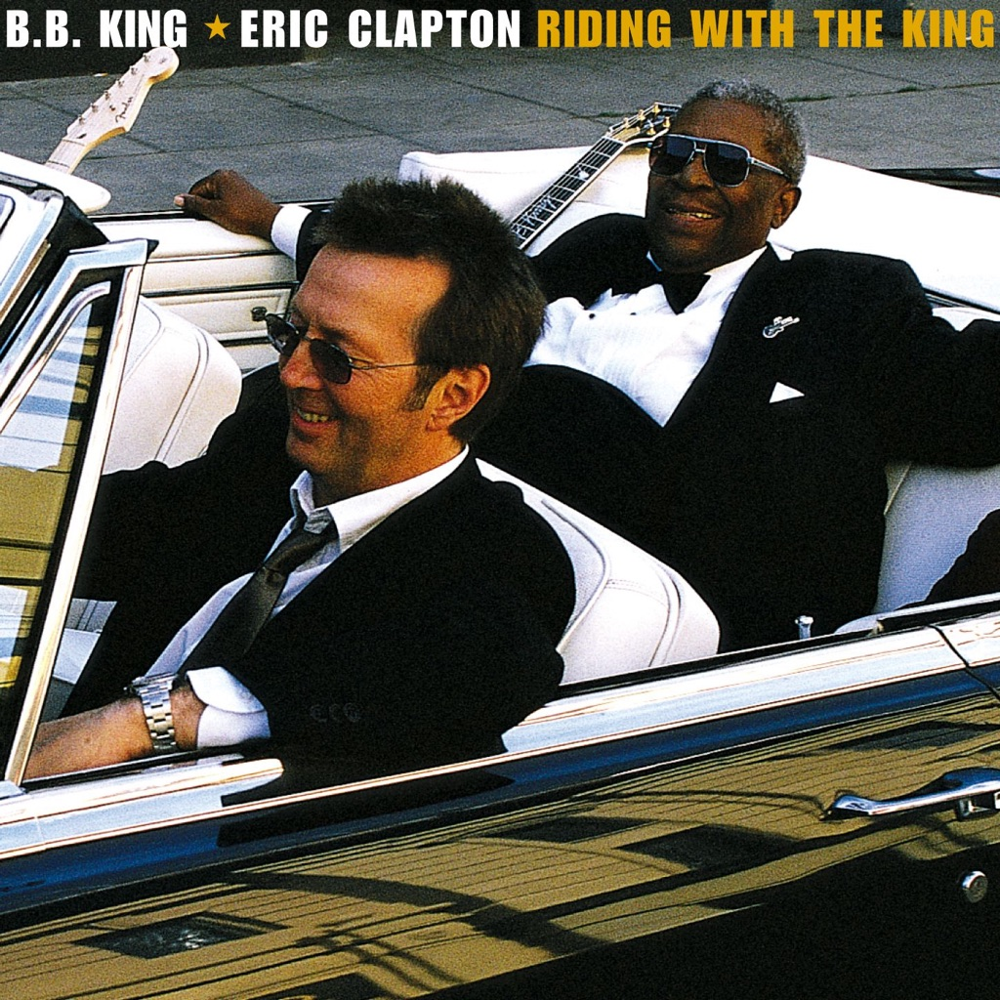

<!-- section break -->

1. Riding With The King (4:23)
2. Ten Long Years (4:41)
3. Key To The Highway (3:40)
4. Marry You (4:59)
5. Three O'Clock Blues (8:37)
6. Help The Poor (5:05)
7. I Wanna Be (4:46)
8. Worried Life Blues (4:26)
9. Days Of Old (3:00)
10. When My Heart Beats Like A Hammer (7:08)
11. Hold On I'm Coming (6:20)
12. Come Rain Or Come Shine (4:10)
13. Rollin' And Tumblin' (4:30)
14. Let Me Love You Baby (5:07)

<!-- section break -->

## Release Information
|  Key           | Value                                                |
| ---------------| ---------------------------------------------------- |
| Release Year   | 2020                                   |
| Discogs Link   | [B.B. King - Riding With The King](https://www.discogs.com/release/15531509-BB-King-Eric-Clapton-Riding-With-The-King) |
| Label          | Reprise Records |
| Format         | Vinyl 2× LP Album Limited Edition Reissue Remastered (Blue, 180 Gram, Gatefold) |
| Catalog Number | 093624893417 |
| Notes | 20th Anniversary Expanded Edition. Pressed on 180 Gram blue colored vinyl, featuring the unreleased tracks “Rollin' And Tumblin’” and “Let Me Love You Baby”.  “Rollin' And Tumblin’” songwriting credit is shown as “P.D.”, so unlinked credit used.  Made in the Netherlands |