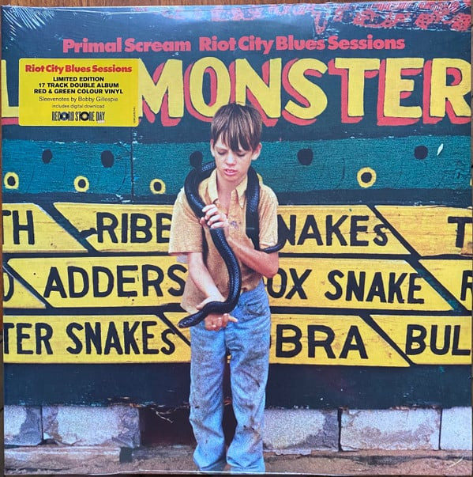

<!-- section break -->

1. Country Girl
2. Nitty Gritty
3. Suicide Sally & Johnny Guitar
4. When the Bomb Drops
5. Stone Ya To The Bone 
6. Gamblin’ Bar Room Blues 
7. Country Blues # 1 / Will I Be Forgiven? 
8. Little Death
9. To Live Is To Fly
10. Zeppelin Blues While Thinking Of Robert Parker 
11. The 99th Floor
12. We’re Gonna Boogie
13. Gimme Some Truth 
14. Dolls (Sweet Rock 'N' Roll) 
15. It’s Not Enough
16. Hell’s Comin’ Down
17. Sometimes I Feel So Lonely

<!-- section break -->

## Release Information
|  Key           | Value                                                |
| ---------------| ---------------------------------------------------- |
| Release Year   | 2021                                   |
| Discogs Link   | [Primal Scream - Riot City Blues Sessions](https://www.discogs.com/release/19112122-Primal-Scream-Riot-City-Blues-Sessions) |
| Label          | Columbia |
| Format         | Vinyl LP (Red Translucent), Vinyl LP (Green Translucent), All Media Album Record Store Day Limited Edition |
| Catalog Number | 19439873831 |
| Notes | RSD June 2021 release.  Gatefold sleeve with two inner sleeves with images, credits, lyrics, and new sleevenotes by Bobby Gillespie.  Includes code for digital download, in 320kbps MP3 format. On the downloaded files, the last note of 'Zeppelin Blues While Thinking Of Robert Parker' is mistakenly indexed as the first note of the following track, 'The 99th Floor'.  Matrix/Runout note: All sides - number/letter strings stamped, text strings etched. |