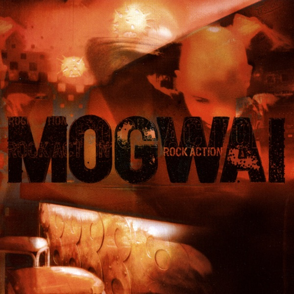

<!-- section break -->

1. Sine Wave
2. Take Me Somewhere Nice
3. O I Sleep
4. Dial: Revenge
5. You Don't Know Jesus
6. Robot Chant
7. 2 Rights Make 1 Wrong
8. Secret Pint

<!-- section break -->

## Spotify


## Videos
### Dial : Revenge
 

### More Videos

- [Two Rights Make One Wrong](https://www.youtube.com/watch?v=zg7REZbQ-A0)
- [Take Me Somewhere Nice](https://www.youtube.com/watch?v=CK1zCi0z_Hk)
- [Sine Wave](https://www.youtube.com/watch?v=4gJueO-_zXE)
- [Secret Pint](https://www.youtube.com/watch?v=JSCb7H4kAIQ)
- [Robot Chant](https://www.youtube.com/watch?v=u7wtHzLqM8Q)
- [You Don't Know Jesus](https://www.youtube.com/watch?v=g1r80NyUHZU)

## Release Information
|  Key           | Value                                                |
| ---------------| ---------------------------------------------------- |
| Release Year   | 2012                                   |
| Discogs Link   | [Mogwai - Rock Action](https://www.discogs.com/release/3969520-Mogwai-Rock-Action) |
| Label          | Southpaw Recordings |
| Format         | Vinyl LP Album Reissue |
| Catalog Number | PAWLP1 |
| Notes | Reissue from early 2000s. Identical to the original release: [r368948], except that 'MOGWAI' on the spine is printed in white rather than black. Printed inner bag and a 4-fold poster inlay.  Some copies dating from 2012 have a '[PIAS] 30 YEARS' sticker in the top left corner.  ℗ PIAS RECORDINGS/SOUTHPAW RECORDINGS 2001 © PIAS RECORDINGS/SOUTHPAW RECORDINGS 2001  Made in the UK.  Recorded at Tarbox Rd Studios Cassadaga, NY Additional recording at Cava Studios Glasgow and Sorcerer Sound NY.  Courtesies: • David Pajo. Courtesy of Drag City • Gruff Rhys. Courtesy of Epic Record • Willie Campbell and Charlie Clark (Fantastic Plastic Records) • Gary Lightbody (Jeepster Recording)  Published by Chrysalis Music except track 4 [...] (Universal Music Publishing) |