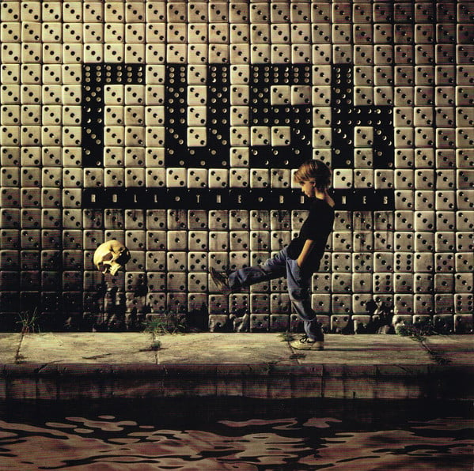

<!-- section break -->

1. Dreamline
2. Bravado
3. Roll The Bones
4. Face Up
5. Where's My Thing? (Part IV, "Gangster Of Boats" Trilogy)
6. The Big Wheel
7. Heresy
8. Ghost Of A Chance
9. Neurotica
10. You Bet Your Life

<!-- section break -->

## Spotify


## Release Information
|  Key           | Value                                                |
| ---------------| ---------------------------------------------------- |
| Release Year   | 2015                                   |
| Discogs Link   | [Rush - Roll The Bones](https://www.discogs.com/release/7632117-Rush-Roll-The-Bones) |
| Label          | Atlantic |
| Format         | Vinyl LP Album Reissue Remastered (200 Gram) |
| Catalog Number | R1 83737 |
| Notes | Recorded February - May, 1991, at Le Studio, Morin Heights, Quebec, and McClear Place, Toronto. Mixed at Nomis Studios, London. Pre-production work at Chalet Studio by Lerxst Sound. Mastered at Masterdisk, NYC.  ℗ 2015 Atlantic Recording Corporation © 2015 Atlantic Recording Corporation and Anthem Entertainment  Reissue on 200g Audiophile Vinyl. Issued with a printed inner sleeve with lyrics. Includes high quality 24-bit digital download. |