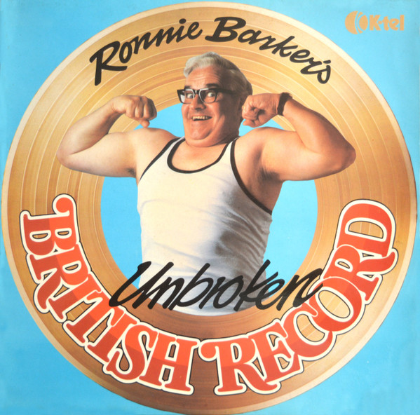

<!-- section break -->

1. The Irish Medley:
2. Plain Speaking
3. The Redskins Annual Dinner
4. The Vicar Of St Cain & Abel
5. The Chelsea Pensioners Medley:
6. The Scottish Medley:
7. They Tell Me There's A Lot Of It About
8. Not Round Here
9. Pismonunciation
10. The Welsh Medley:

<!-- section break -->

## Release Information
|  Key           | Value                                                |
| ---------------| ---------------------------------------------------- |
| Release Year   | 1978                                   |
| Discogs Link   | [Ronnie Barker - Ronnie Barker's Unbroken British Record](https://www.discogs.com/release/4087625-Ronnie-Barker-Ronnie-Barkers-Unbroken-British-Record) |
| Label          | K-Tel |
| Format         | Vinyl LP Album |
| Catalog Number | NE 1029 |
| Notes | Produced & Co-ordinated by John Schroeder. A Smug Production. |