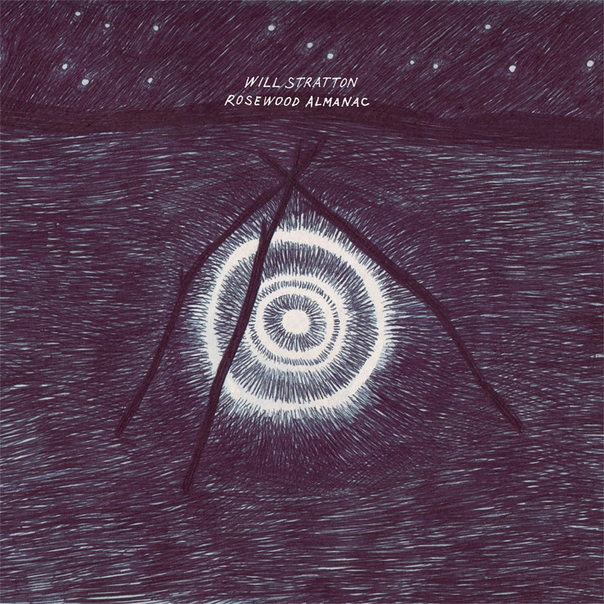

<!-- section break -->

1. Light Blue (4:06)
2. Thick Skin (3:06)
3. Manzanita (3:46)
4. Vanishing Class (4:10)
5. Whatever's Divine (2:48)
6. I See You (4:14)
7. Some Ride (3:00)
8. Skating On The Glass (2:07)
9. This Is What We Do (3:23)
10. Ribbons (3:09)

<!-- section break -->

## Spotify


## Videos
### Will Stratton - Light blue
 

### More Videos

- [Vanishing Class](https://www.youtube.com/watch?v=LWUGoiw7yyY)

## Release Information
|  Key           | Value                                                |
| ---------------| ---------------------------------------------------- |
| Release Year   | 2017                                   |
| Discogs Link   | [Will Stratton - Rosewood Almanac](https://www.discogs.com/release/10279453-Will-Stratton-Rosewood-Almanac) |
| Label          | Bella Union |
| Format         | Vinyl LP Album |
| Catalog Number | BELLA616V |
| Notes | Includes download card and printed inner sleeve with lyrics and credits. |