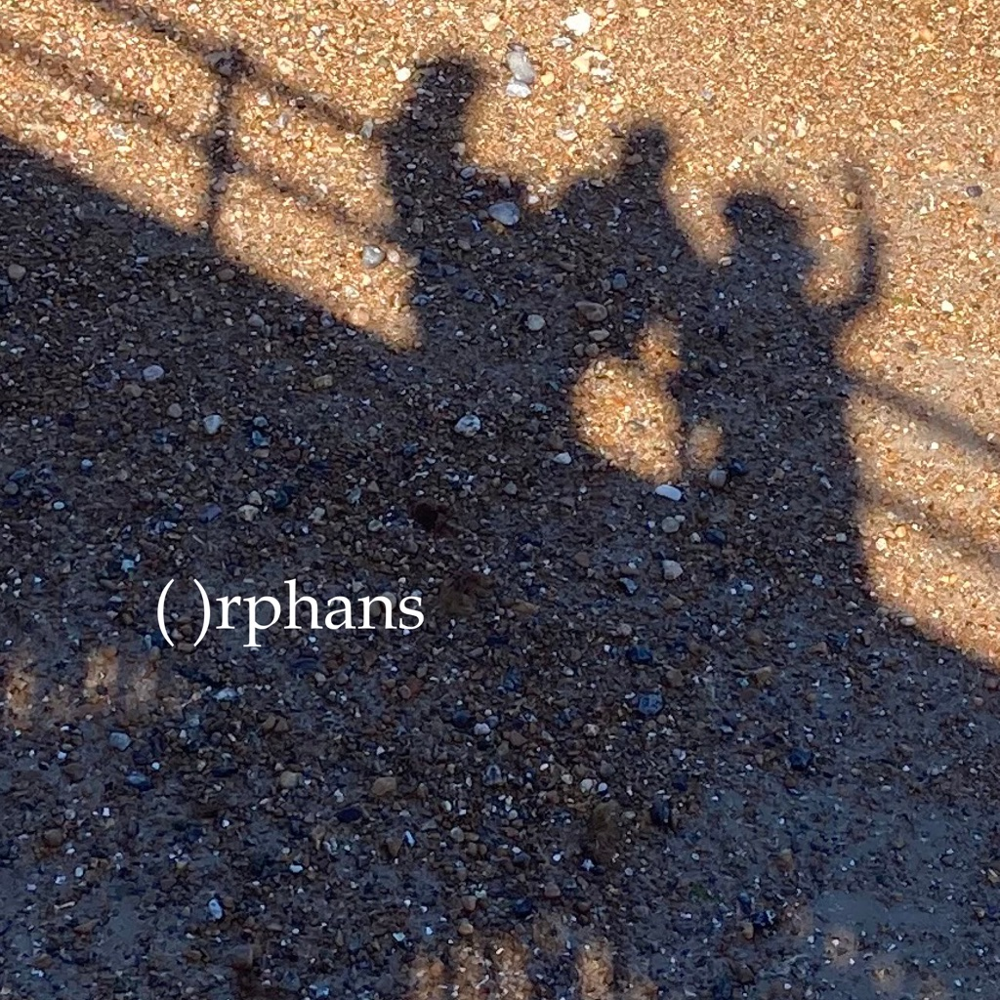

<!-- section break -->

1. Theme (From Crocodile Dundee)
2. Astral Womb
3. Pink Bows
4. Mannequin
5. Don't Wear The Crown
6. Orphans

<!-- section break -->

## Spotify


## Release Information
|  Key           | Value                                                |
| ---------------| ---------------------------------------------------- |
| Release Year   | 2022                                   |
| Discogs Link   | [Sel Balamir - ( )rphans](https://www.discogs.com/release/25320166-Sel-Balamir--rphans) |
| Label          | Rockosmos |
| Format         | Vinyl LP Album (Purple Opaque With Black, White & Yellow Splatter) |
| Catalog Number | ROK251 |
| Notes | 180g vinyl. Includes a printed inner sleeve with lyrics.  Funded via Bandcamp's vinyl pressing service. |