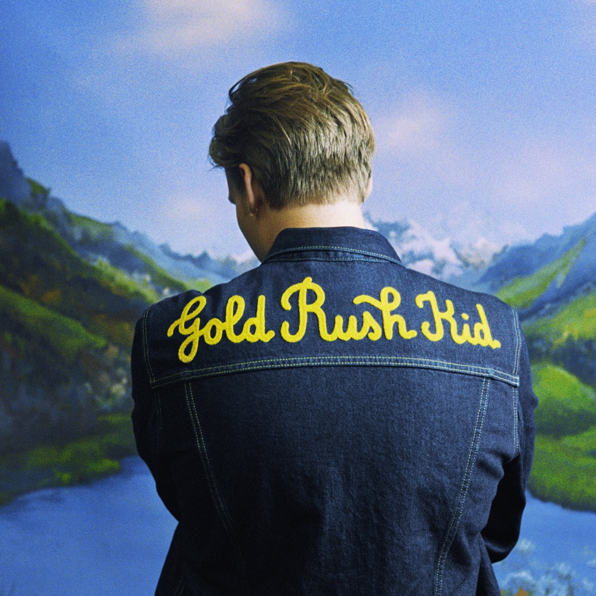

<!-- section break -->

1. Finding My Way (5:03)
2. Need Some Love (2:16)
3. Take A Friend (4:27)
4. Here Again (7:30)
5. What You're Doing (4:19)
6. In The Mood (3:36)
7. Before And After (5:33)
8. Working Man (7:07)

<!-- section break -->

## Spotify


## Release Information
|  Key           | Value                                                |
| ---------------| ---------------------------------------------------- |
| Release Year   | 2014                                   |
| Discogs Link   | [Rush - Rush](https://www.discogs.com/release/5887416-Rush-Rush) |
| Label          | Moon Records (18) |
| Format         | Vinyl LP Album Limited Edition Reissue Remastered (200 Gram), Box Set |
| Catalog Number | MN 100 |
| Notes | ReDISCovered - Limited edition 200g 40th anniversary reissue of 1974 Moon Records album - Jacket art features all original 1974 details - Exclusive poster, band photo prints and Rush family tree - Digital download card - 320 kbps - Vinyl ripped AAC MP4s - Direct Metal Mastering DMM  Published by Core Music, CAPAC Tracks A1, A2, A4, B1, B3 and B4 recorded at Toronto Sound Studios Tracks A3 and B1 to B4 recorded at Eastern Sound Remixed at Toronto Sound  DMM Mastering at Abbey Road Studios - December 2013  Moon Records is a subsidiary of SRO Productions Ltd.  ℗ © 2014 The Island Def Jam Music Group  On center labels: ℗ 1974 S.R.O. Productions All selections - MAPL  [url=https://www.discogs.com/Rush-Rush-ReDISCovered/release/5659122]Similar release[/url] is the USA / Canada release [url=https://www.discogs.com/release/15631764-Rush-Rush]Similar release[/url] is a European release without the Universal Logo on the back of the box and no Download Code Sheet. |