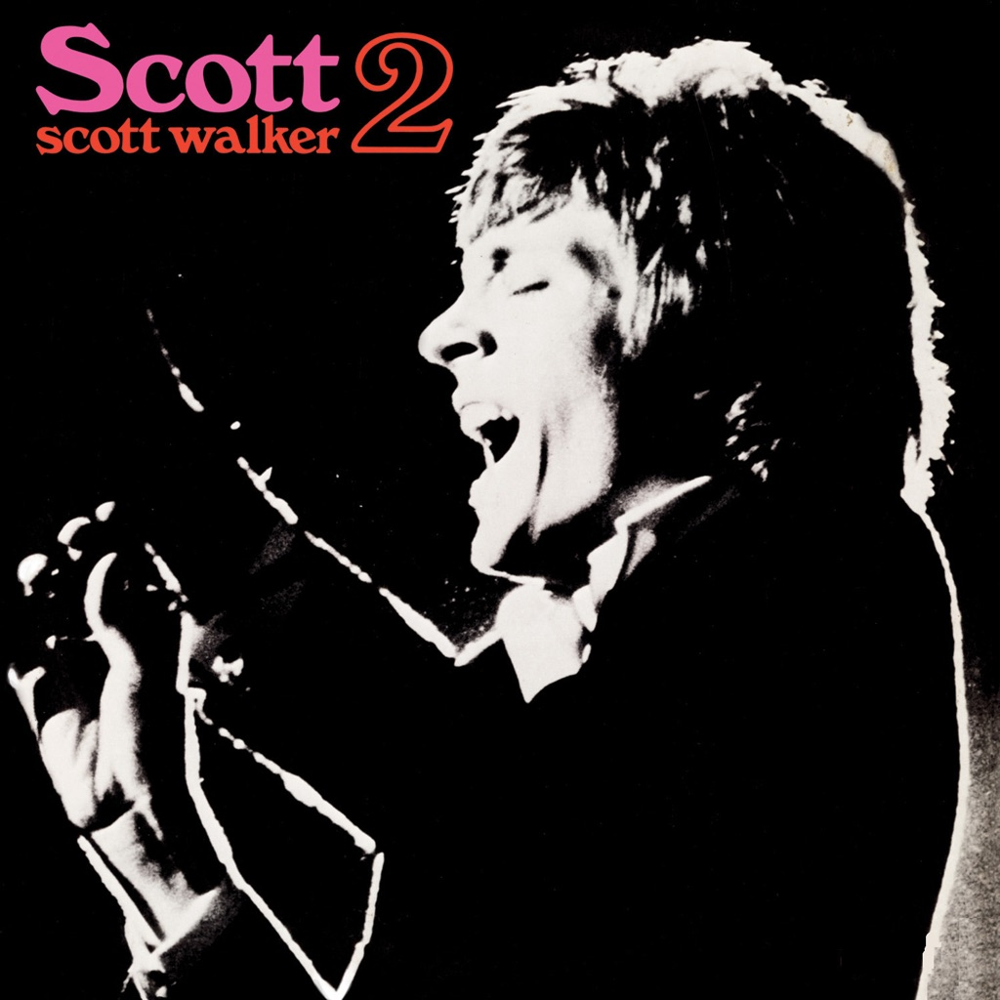

<!-- section break -->

1. Jackie
2. Best Of Both Worlds
3. Black Sheep Boy
4. The Amorous Humphrey Plugg
5. Next
6. The Girls From The Streets
7. Plastic Palace People
8. Wait Until Dark
9. The Girls And The Dogs
10. Windows Of The World
11. The Bridge
12. Come Next Spring

<!-- section break -->

## Spotify


## Videos
### Plastic Palace People
 

### More Videos

- [Scott Walker - The Amorous Humphrey Plugg](https://www.youtube.com/watch?v=JFXuMljSY7g)
- [Scott Walker - Jackie](https://www.youtube.com/watch?v=eKtZf62BQzM)
- [Scott Walker - The Girls from the Street](https://www.youtube.com/watch?v=Jj_C6Rv0HV0)
- [The Girls And The Dogs](https://www.youtube.com/watch?v=8p70xFGQTOs)
- [Scott Walker (The Walker Brothers) ~ The Windows of The World](https://www.youtube.com/watch?v=oywI42UcxY4)
- [Scott Walker - Come Next Spring](https://www.youtube.com/watch?v=LWy7dJU-7RE)
- [Scott Walker   Next](https://www.youtube.com/watch?v=gR3W6vmgg_I)

## Release Information
|  Key           | Value                                                |
| ---------------| ---------------------------------------------------- |
| Release Year   | 1968                                   |
| Discogs Link   | [Scott Walker - Scott 2](https://www.discogs.com/release/2403028-Scott-Walker-Scott-2) |
| Label          | Philips |
| Format         | Vinyl LP Album Stereo |
| Catalog Number | SBL7840 |
| Notes | Included 11" by 11" artist portrait insert.  SBL7840 on spine & rear cover, SBL.7840 on labels, 844 210 BY on rear cover & labels.  A1. ℗ 1967 A2 to B6. ℗ 1968  A1, A5, B3. Carlin/BIEM A2. Lords Music A3. Robbins Music A4, A6, B1, B5. Miracle Songs B2. Blossom Music B4. Blue Seas/Jac B6. Frank Music |