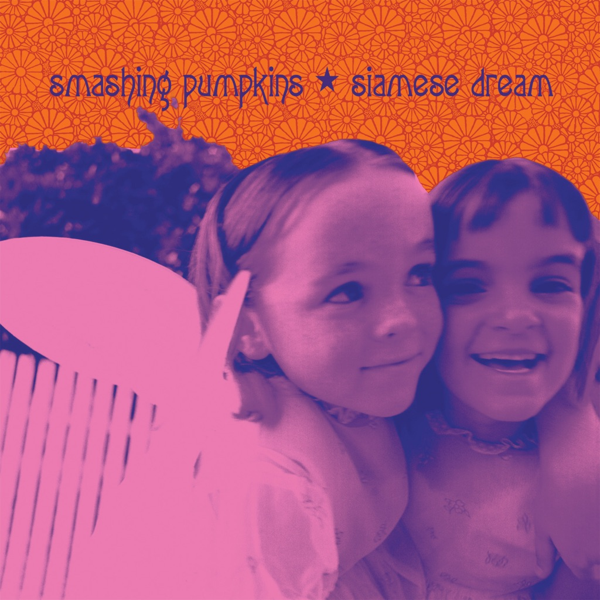

<!-- section break -->

1. Cherub Rock
2. Quiet
3. Today
4. Hummer
5. Rocket
6. Disarm
7. Soma
8. Geek U.S.A.
9. Mayonaise
10. Spaceboy
11. Silverfuck
12. Sweet Sweet
13. Luna

<!-- section break -->

## Spotify


## Release Information
|  Key           | Value                                                |
| ---------------| ---------------------------------------------------- |
| Release Year   | 2011                                   |
| Discogs Link   | [The Smashing Pumpkins - Siamese Dream](https://www.discogs.com/release/3255473-Smashing-Pumpkins-Siamese-Dream) |
| Label          | Virgin |
| Format         | Vinyl 2× LP Album Reissue Remastered (180 Gram, Gatefold) |
| Catalog Number | 50999 67928 9 10 |
| Notes | Hype sticker reads; " Smashing Pumpkins Siamese Dream One Of The Most Influential Albums Of The 90's Remastered And Reissued For The First Time On 180 Gram Vinyl ! Includes: Today, Disarm and Cherub Rock -  5099967928910 "  Ⓟ&Ⓒ 2011 Virgin Records America, Inc. Manufactured by Virgin Records America, Inc. 150 Fifth Avenue, New York, NY 10011. Gatefold sleeve. Features liner notes and track commentary from Billy Corgan. Also included are never before seen collages, photos, and postcards! All content was personally curated by founding member Billy Corgan.  Due to the Metallic Effect of the outer printed sleeve:Track listings, barcode and other info are printed on a additional single sided sheet. No printed text/barcode appears on actual rear sleeve.  High quality printed inner sleeves include lyrics. |