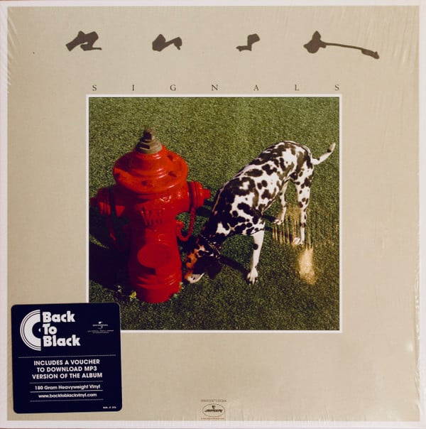

<!-- section break -->

1. Subdivisions
2. The Analog Kid
3. Chemistry
4. Digital Man
5. The Weapon
6. New World Man
7. Losing It
8. Countdown

<!-- section break -->

## Spotify


## Release Information
|  Key           | Value                                                |
| ---------------| ---------------------------------------------------- |
| Release Year   | 2015                                   |
| Discogs Link   | [Rush - Signals](https://www.discogs.com/release/7396893-Rush-Signals) |
| Label          | Anthem (5) |
| Format         | Vinyl LP Album Reissue Remastered (180 Gram) |
| Catalog Number | 00602547118264 |
| Notes | Black label on Shrink Wrap    Back To Black    Includes a voucher to download an MP3 of the album    180g Heavyweight Vinyl      www.backtoblackvinyl.com    Rear Cover     Anthem  Mercury  UMG  DMM |