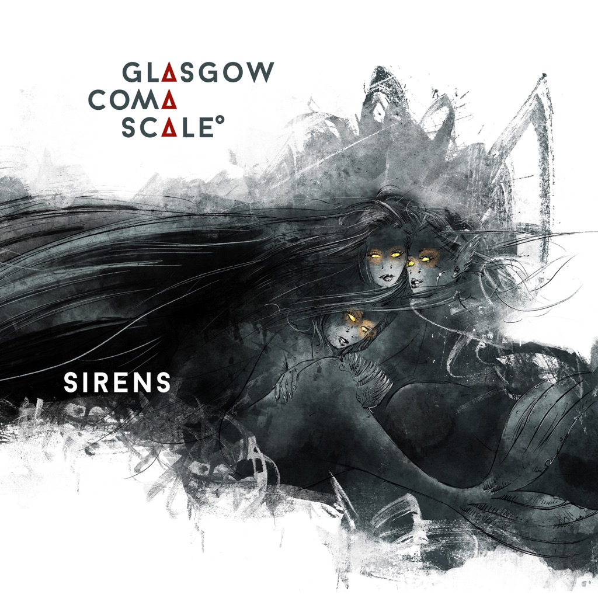

<!-- section break -->

1. Orion (7:49)
2. Magik (6:38)
3. Underskin (8:05)
4. Sirens (6:20)
5. Day 366 (9:08)
6. One Must Fall (6:47)

<!-- section break -->

## Spotify


## Release Information
|  Key           | Value                                                |
| ---------------| ---------------------------------------------------- |
| Release Year   | 2021                                   |
| Discogs Link   | [Glasgow Coma Scale - Sirens](https://www.discogs.com/release/20160328-Glasgow-Coma-Scale-Sirens) |
| Label          | Tonzonen Records |
| Format         | Vinyl LP Album Limited Edition (Red) |
| Catalog Number | TON109 |
| Notes | Limited to 750 (red), Gatefold Cover, Download-Card, Poster  Recorded and mixed Tonstudio45, Lahnstein in 2020 Mastered by [...], Berlin in 2020-2021 Artwork : [...] : sulewski.net  Cat# 1 appears on rear cover Cat# 2 appears on spine |