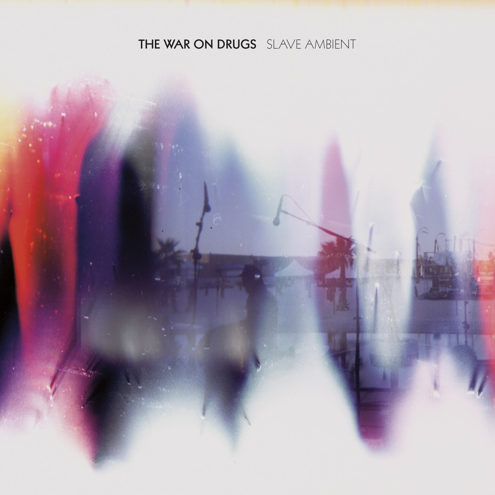

<!-- section break -->

1. Best Night
2. Brothers
3. I Was There
4. Your Love Is Calling My Name
5. The Animator
6. Come To The City
7. Come For It
8. It's Your Destiny
9. City Reprise #12
10. Baby Missiles
11. Original Slave
12. Black Water Falls

<!-- section break -->

## Spotify


## Videos
### The War On Drugs - Baby Missiles  (Official Video)
 

### More Videos

- [The War on Drugs - Black Water Falls](https://www.youtube.com/watch?v=EUNSaSkDNKQ)
- [The War on Drugs — Come to the City (Official Music Video)](https://www.youtube.com/watch?v=FMqWSFNC1jU)
- [Best Night - The War On Drugs (HQ)](https://www.youtube.com/watch?v=nvOQRlIRxO8)
- [The War On Drugs - Brothers (Official Video)](https://www.youtube.com/watch?v=TW8Hi_s2K34)

## Release Information
|  Key           | Value                                                |
| ---------------| ---------------------------------------------------- |
| Release Year   | 2011                                   |
| Discogs Link   | [The War On Drugs - Slave Ambient](https://www.discogs.com/release/3052756-The-War-On-Drugs-Slave-Ambient) |
| Label          | Secretly Canadian |
| Format         | Vinyl 2× 12" 45 RPM Album |
| Catalog Number | SC190 |
| Notes | Includes a download card for a free high-quality digital version. Each record is in a printed inner sleeve.  ©&℗ 2011 Secretly Canadian  Recorded 2008-2011 at Uniform Studio (Philly), Echo Mountain (Asheville, NC), AG's joint in Philly.  All words and music by Adam Granduciel/Seaformation Music (ASCAP) except Brothers (Granduciel/Hartley/Zanghi/Bennett), Come To The City (Granduciel/Hartley), It's Your Destiny (Granduciel/Bennett)  Photography: Cover - Zaragoza, Spain, Drugs Tour, July 2009 Inside - Livingston, MT. Violators Tour, October 2009 |