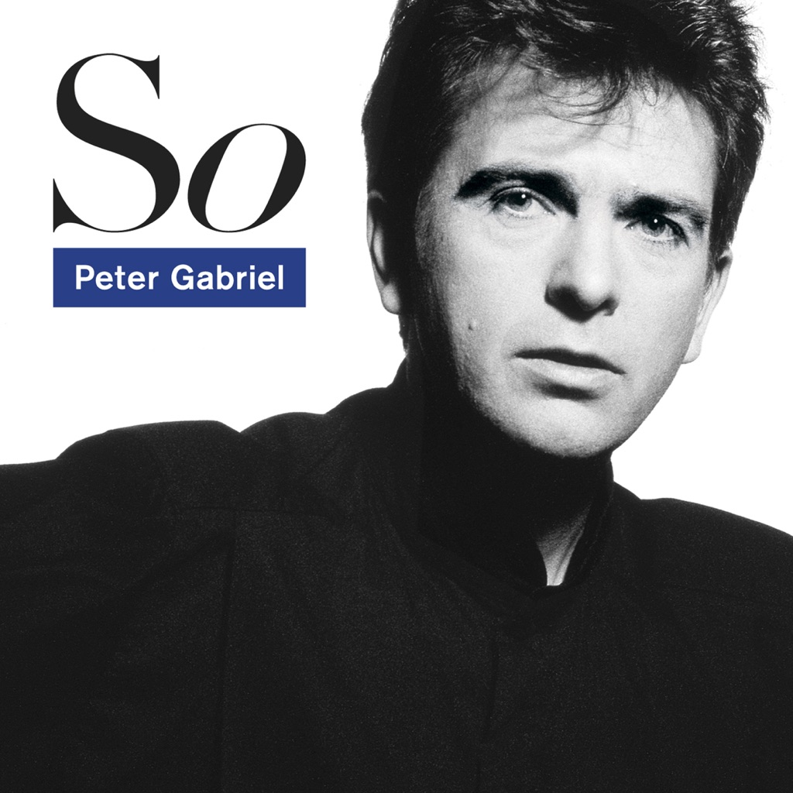

<!-- section break -->

1. Red Rain
2. Sledgehammer
3. Don't Give Up
4. That Voice Again
5. Mercy Street
6. Big Time
7. We Do What We're Told (Milgram's 37)
8. This Is The Picture (Excellent Birds)
9. In Your Eyes

<!-- section break -->

## Spotify


## Release Information
|  Key           | Value                                                |
| ---------------| ---------------------------------------------------- |
| Release Year   | 2016                                   |
| Discogs Link   | [Peter Gabriel - So ](https://www.discogs.com/release/8744459-Peter-Gabriel-So-) |
| Label          | Caroline International |
| Format         | Vinyl 2× LP 45 RPM Album Deluxe Edition Limited Edition Numbered Reissue Remastered (180g, Half Speed Remaster) |
| Catalog Number | PGLPR5X |
| Notes | The album has been Half-Speed Remastered and cut to lacquers at 45RPM, across 2 x heavyweight LPs, to deliver maximum dynamic range in the sound. The vinyl cutting and mastering was overseen by Peter’s main sound engineer, Richard 'Dickie' Chappell. Gatefold sleeves utilise imagery from the original LP inner bags and all images are newly re-scanned. The album also contains a time-limited download card with a choice of digital download (Hi-Res 24bit/96k or 16bit/44.1k).  Each disc is housed in a plain white poly lined inner sleeve. The gatefold inner spread has lyrics and credits. C1 is titled  'Mercy Street for Anne Sexton'   The first Catalog number appears back cover top right, spine, inner gatefold spread and labels. The second appears back cover lower left and on the sticker.  From back cover: ℗ 2016 Peter Gabriel Ltd © 2016 Peter Gabriel Ltd Manufactured in the EU  From inner gatefold spread: Originally mastered by Ian Cooper at The Town House, London Vinyl cut by Mark Colton at Alchemy Mastering Mastered by Tony Cousins at Metropolis All songs published by Real World Music Ltd/EMI Music Publishing Ltd except 'This Is The Picture - excellent birds' published by Difficult Music/Universal Music Publishing MGB Ltd/Real World Music Ltd/EMI Music Publishing Ltd All tracks recorded and mixed at Real Worls Studios, England except for 'Mercy Street'; percussion recorded in Polygram Studios, Rio de Janeiro, engineered by Ary Carvalhaes and Jairo Gualberto, studio organisation by Luigi Hoffer, session supervision by Renato Costa and Graciela Silberberg. New York overdubs recorded at The Power Station, engineered by Bruce Lampcov, assisted by Steve Boyer, session supervision by Charlene Colon For additional work on tracks not included, thanks to Larry Fast, Jimmy Bralower, Paul Higgins and The House of Music  Runouts are etched except '14991 1X 00884108004340' is stamped, where 1X is 1A, 1B, 1C or 1D depending on the side. |