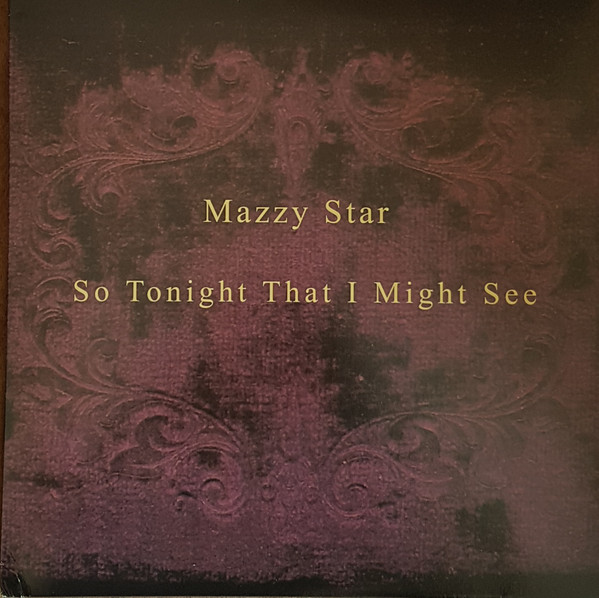

<!-- section break -->

1. Fade Into You (4:55)
2. Bells Ring (4:32)
3. Mary Of Silence (6:02)
4. Five String Serenade (4:24)
5. Blue Light (5:10)
6. She's My Baby (4:25)
7. Unreflected (3:42)
8. Wasted (5:31)
9. Into Dust (5:36)
10. So Tonight That I Might See (7:19)

<!-- section break -->

## Spotify


## Videos
### So Tonight That I Might See
 

### More Videos

- [Fade Into You](https://www.youtube.com/watch?v=avv2IIdDnnk)
- [Bells Ring](https://www.youtube.com/watch?v=44OjwGThpbU)
- [Mary Of Silence](https://www.youtube.com/watch?v=j9Nl7FlrMpw)
- [Five String Serenade](https://www.youtube.com/watch?v=IbfKJoh1lNA)
- [Mazzy Star - Fade Into You (Official Music Video)](https://www.youtube.com/watch?v=ImKY6TZEyrI)
- [Blue Light](https://www.youtube.com/watch?v=H7VUO-WxppY)
- [She's My Baby](https://www.youtube.com/watch?v=_AalUu5JY9M)
- [Unreflected](https://www.youtube.com/watch?v=CZXUFYsKKSo)
- [Wasted](https://www.youtube.com/watch?v=3XWj4YMWyjU)
- [Into Dust](https://www.youtube.com/watch?v=04J0ihSeIuI)

## Release Information
|  Key           | Value                                                |
| ---------------| ---------------------------------------------------- |
| Release Year   | 2017                                   |
| Discogs Link   | [Mazzy Star - So Tonight That I Might See](https://www.discogs.com/release/10806771-Mazzy-Star-So-Tonight-That-I-Might-See) |
| Label          | Capitol Records |
| Format         | Vinyl LP Album Reissue (180g) |
| Catalog Number | 00602557537574 |
| Notes | A Capitol Records release; ℗ 2016 © 2017 Capitol Records, LLC. All rights reserved. Unauthorised copying, reproducing, hiring, lending, public performance and broadcasting prohibited. Made in the EU. LC 06406. 006062557537574. Universal International Music B.V. Gerrit Van Der Veenlaan 4, 3743 DN, Baarn, Netherlands.  MP3 download coupon included. |