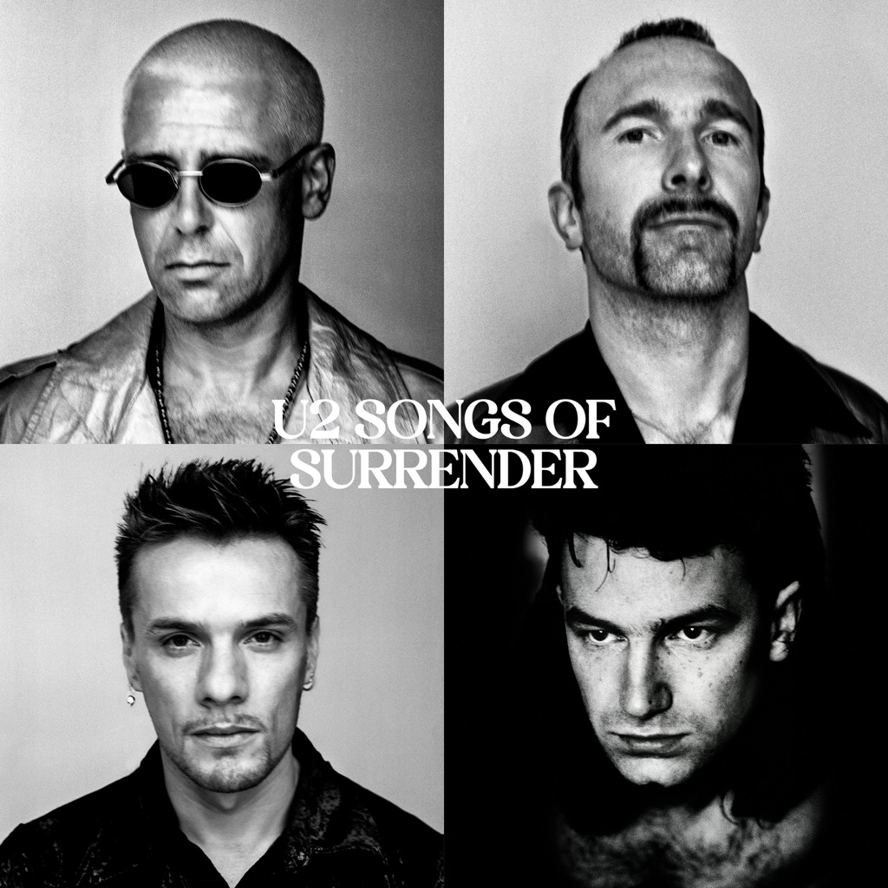

<!-- section break -->

1. One (3:36)
2. Where The Streets Have No Name (4:17)
3. Stories For Boys (2:51)
4. Walk On (Ukraine) (4:07)
5. Pride (In The Name Of Love) (3:57)
6. City Of Blinding Lights (4:55)
7. Ordinary Love (3:13)
8. Invisible (4:23)
9. Vertigo (3:29)
10. I Still Haven't Found What I'm Looking For (4:15)
11. The Fly (4:02)
12. If God Will Send His Angels (5:15)
13. Stay (Faraway, So Close) (5:03)
14. Sunday Bloody Sunday (4:13)
15. I Will Follow (3:40)
16. "40" (3:03)

<!-- section break -->

## Spotify


## Release Information
|  Key           | Value                                                |
| ---------------| ---------------------------------------------------- |
| Release Year   | 2023                                   |
| Discogs Link   | [U2 - Songs Of Surrender](https://www.discogs.com/release/26446712-U2-Songs-Of-Surrender) |
| Label          | Island Records |
| Format         | Vinyl 2× LP Limited Edition (Orange Translucent, 180g) |
| Catalog Number | 5503448 |
| Notes | 16 new acoustic & reimagined recordings from the U2 catalogue. Limited Edition Amazon Exclusive Translucent Orange 2 LP. Pressed on 180-gram vinyl with 4-page insert featuring liner notes from The Edge.  On sleeve printed "Made in EU". Sticker on cellophane reads "Made in Germany". |