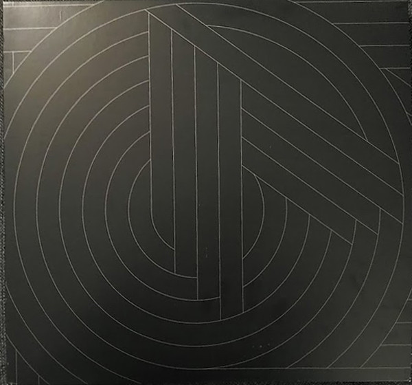

<!-- section break -->

1. Electricity
2. Red Frame/White Light
3. Messages
4. Enola Gay
5. Souvenir
6. Joan Of Arc
7. Maid Of Orleans
8. Genetic Engineering
9. Telegraph
10. Locomotion
11. Talking Loud & Clear
12. Tesla Girls
13. Never Turn Away
14. So In Love
15. Secret
16. La Femme Accident
17. If You Leave
18. (Forever) Live & Die
19. We Love You
20. Shame
21. Dreaming
22. Sailing On The Seven Seas
23. Pandora's Box (It's A Long, Long Way)
24. Then You Turn Away
25. Call My Name
26. Stand Above Me
27. Dream Of Me
28. Everyday
29. Walking On The Milky Way
30. Universal
31. If You Want It
32. Sister Marie Says
33. History Of Modern (Part 1)
34. Metroland
35. Dresden
36. Night Cafe
37. Isotype
38. The Punishment Of Luxury
39. What Have We Done
40. Don't Go

<!-- section break -->

## Spotify


## Videos
### Souvenir (Remastered 2019)
 

## Release Information
|  Key           | Value                                                |
| ---------------| ---------------------------------------------------- |
| Release Year   | 2019                                   |
| Discogs Link   | [Orchestral Manoeuvres In The Dark - Souvenir](https://www.discogs.com/release/14216215-Orchestral-Manoeuvres-In-The-Dark-Souvenir) |
| Label          | Virgin EMI Records |
| Format         | Vinyl 3× LP Compilation (180 Gram) |
| Catalog Number | 7743914 |
| Notes | Tri-fold sleeve.  Some copies include a digital download card (WAV) and an additional line "includes digital download card" on the hype sticker.  "A Virgin EMI Records Release" A Universal Music Company  Band billed as "OMD Orchestral Manoeuvres In The Dark" on the hype sticker.  Made in the EU. |