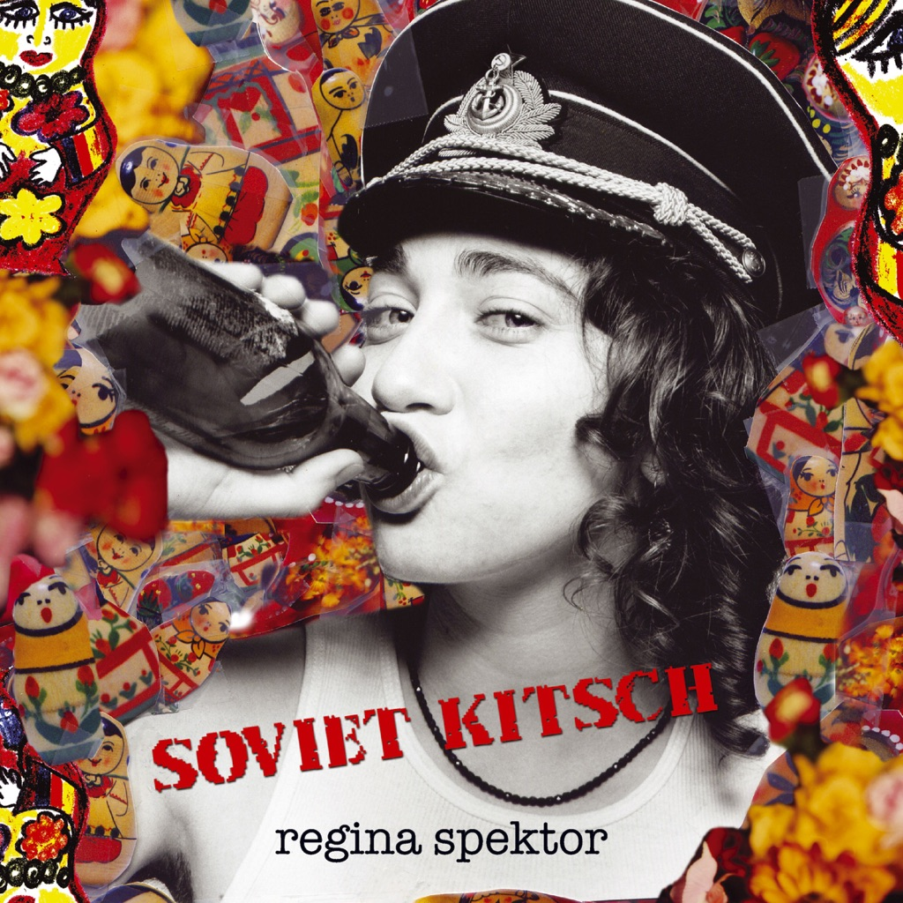

<!-- section break -->

1. Ode To Divorce (3:43)
2. Poor Little Rich Boy (2:25)
3. Carbon Monoxide (4:55)
4. The Flowers (3:52)
5. Us (4:50)
6. Sailor Song (3:15)
7. * * * (0:45)
8. Your Honor (2:09)
9. Ghost Of Corporate Future (3:19)
10. Chemo Limo (6:02)
11. Somedays (3:22)
12. Bonus 7"
13. Us (Video Edit) (4:00)
14. Scarecrow & Fungus (2:29)
15. December (2:08)

<!-- section break -->

## Spotify


## Videos
### Carbon Monoxide - Regina Spektor - Lyrics On Screen
 

### More Videos

- [Regina Spektor - Us [OFFICIAL Video]](https://www.youtube.com/watch?v=fczPlmz-Vug)
- [Regina Spektor Ode to Divorce Music Video](https://www.youtube.com/watch?v=PhLnPifHqQU)
- [Regina Spektor - Poor Little Rich Boy](https://www.youtube.com/watch?v=9GS5CpYTcfM)
- [The Flowers-Regina Spektor](https://www.youtube.com/watch?v=cO5evGShbmU)
- [Regina Spektor - Sailor Song](https://www.youtube.com/watch?v=Uro9hjHSsiw)

## Release Information
|  Key           | Value                                                |
| ---------------| ---------------------------------------------------- |
| Release Year   | 2016                                   |
| Discogs Link   | [Regina Spektor - Soviet Kitsch](https://www.discogs.com/release/8444148-Regina-Spektor-Soviet-Kitsch) |
| Label          | Sire |
| Format         | Vinyl LP Album Record Store Day Limited Edition Reissue (Red), Vinyl 7" 45 RPM Single Limited Edition (Large Center Hole) |
| Catalog Number | 9362-49267-9 |
| Notes | ℗ 2004, 2005 Sire Records for the US  and WEA International Inc. © 2005 Sire Records for the US  and WEA International Inc. Manufactured in E.U. Comes with double-printed lyric sheet.  LP: © 2005 Sire Records ℗ 2004, 2005 Sire Records. Manufactured in The Netherlands. 7": © ℗ 2016 Sire Records. Manufactured in The Netherlands. Has a large ("dinked") center hole  A Record Store Day 2016 release. Limited to 3,000 copies.  |