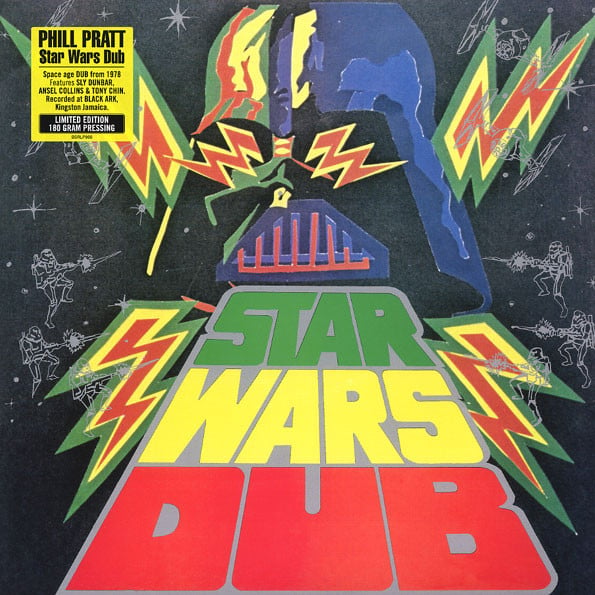

<!-- section break -->

1. African Communication
2. Which Clapp
3. Star Wars
4. Side Walk Rider
5. Tower Dub
6. Stay Loose
7. Con-Man
8. Concertman
9. Roffa Yet

<!-- section break -->

## Spotify


## Videos
### Lipi Brown's Selections - Star Wars Dub
 

## Release Information
|  Key           | Value                                                |
| ---------------| ---------------------------------------------------- |
| Release Year   | 2016                                   |
| Discogs Link   | [Phil Pratt - Star Wars Dub](https://www.discogs.com/release/8324465-Phill-Pratt-Star-Wars-Dub) |
| Label          | Burning Sounds |
| Format         | Vinyl LP Limited Edition Reissue (180 Gram) |
| Catalog Number | BSRLP988 |
