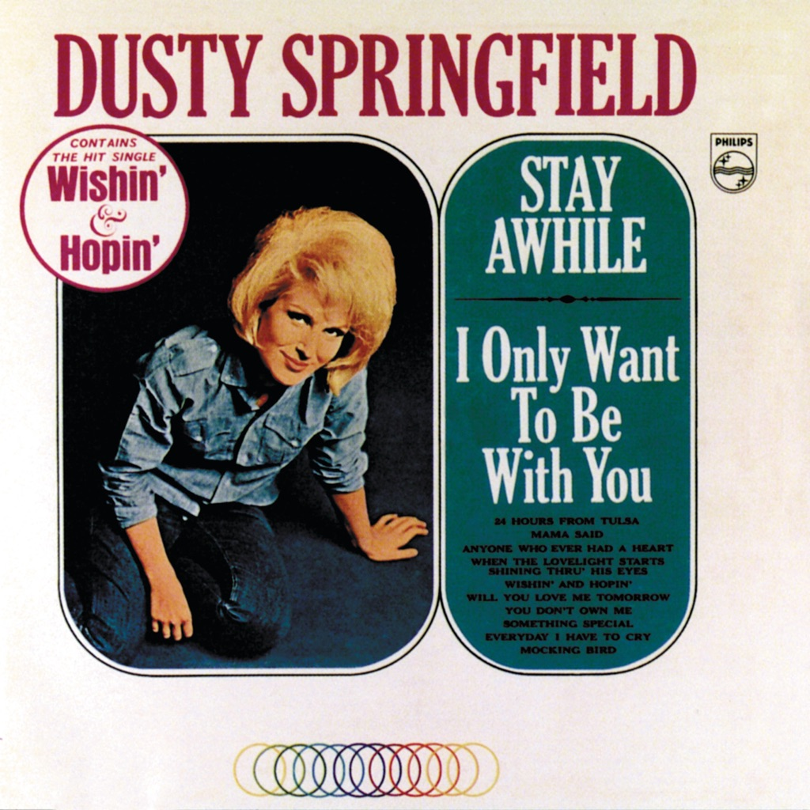

<!-- section break -->

1. I Only Want To Be With You
2. Stay Awhile
3. Mama Said
4. Anyone Who Had A Heart
5. When The Lovelight Starts Shining Thru His Eyes
6. Wishin' And Hopin'
7. Mockingbird
8. You Don't Own Me
9. Something Special
10. Every Day I Have To Cry

<!-- section break -->

## Spotify


## Videos
### Stay Awhile
 

### More Videos

- [Wishin' And Hopin'](https://www.youtube.com/watch?v=dyZG1s7gbn8)
- [You Don't Own Me](https://www.youtube.com/watch?v=nAQKgOmUk-U)
- [Every Day I Have To Cry](https://www.youtube.com/watch?v=-8VJz9JHGSc)
- [I Only Want To Be With You](https://www.youtube.com/watch?v=6opirWRSj4c)
- [Mama Said](https://www.youtube.com/watch?v=NyikIdu9gks)
- [Anyone Who Had A Heart](https://www.youtube.com/watch?v=O6NOByozZVo)
- [When The Love Light Starts Shining Thru His Eyes](https://www.youtube.com/watch?v=IrVqT5C7mOQ)
- [Mockingbird](https://www.youtube.com/watch?v=0BEIGZf1IBI)
- [Something Special](https://www.youtube.com/watch?v=rnZ1iU2-No8)

## Release Information
|  Key           | Value                                                |
| ---------------| ---------------------------------------------------- |
| Release Year   | 1969                                   |
| Discogs Link   | [Dusty Springfield - Stay Awhile](https://www.discogs.com/release/651808-Dusty-Springfield-Stay-Awhile) |
| Label          | Wing Records |
| Format         | Vinyl LP Album Reissue |
| Catalog Number | WL.1211, WL 1211 |
| Notes | Release has a small Q + A with Dusty on the rear cover.  Month of release information from Record Collector Magazine Jan 1994 p.211  |